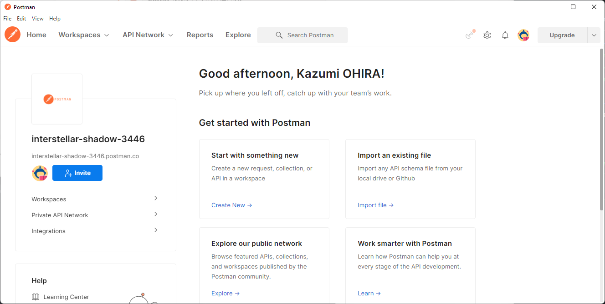
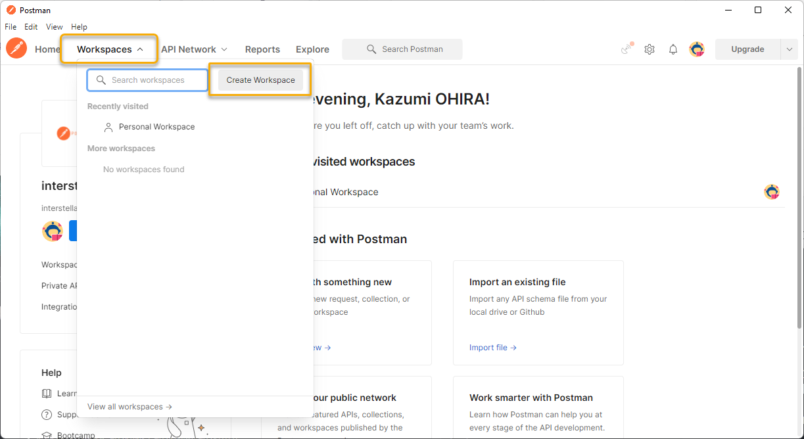
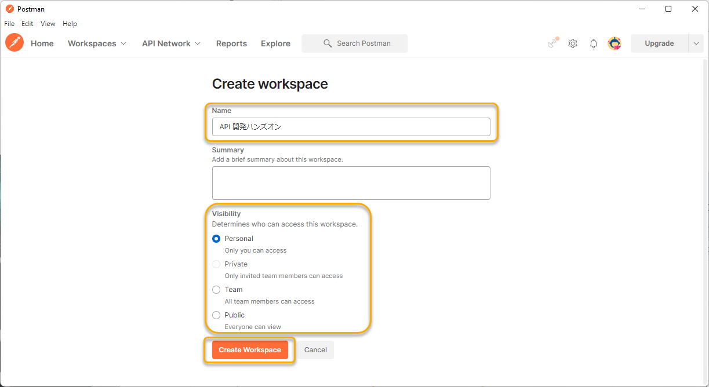
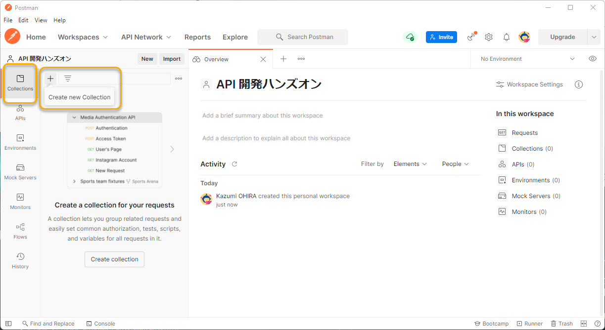
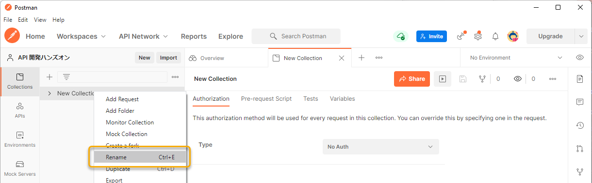
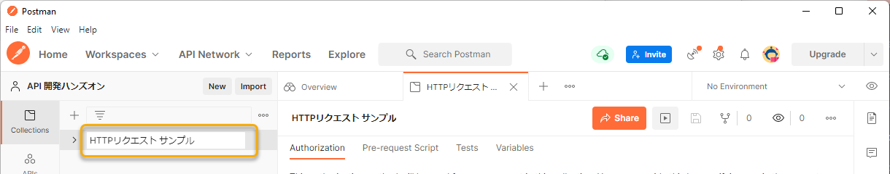
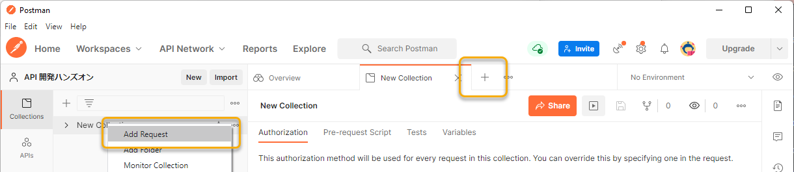

# API を使ってみる

## 大まかな流れ

- [API の要点をおさらい](#api-の要点をおさらい)
- [REST クライアントの使い方](#rest-クライアントの使い方)
- [GET リクエストを行う](#get-リクエストを行う)
- [POST リクエストを行う](#post-リクエストを行う)

## API の要点をおさらい

API (Application Programming Interface) で抑えるべきポイントをおさらいしましょう。

なお、ここでは HTTP プロトコルにおける API を取り扱います。

### HTTP プロトコルにおける API

| ポイント | 説明 |
|----|----|
| HTTP リクエスト | HTTP プロトコルに則り送信するリクエスト。URL が示すリソースに対して、メソッドの指定や、クエリ、リクエストボディなどを用いて処理条件を渡すことで、処理結果を得ることができる。 |
| HTTP レスポンス | HTTP リクエストに対する応答。HTTP ステータスや本文によって処理結果が返却される。本文の形式は、リクエストの `Accept` によって選択されるのが一般的。 |
| URL | ウェブ上のリソースを識別してアクセスするための、プロトコルやドメイン、ポート、そしてパスを含む文字列。 |
| HTTP メソッド | HTTP リクエストにおけるメソッド。`GET`, `POST`, `PUT`, `DELETE` などが利用される。 |
| クエリ | HTTP リクエストにおいて、URL の末尾に付与する形式で渡す処理条件のひとつ。URLの末尾に `?` で連結し、キーと値の組合せを渡すことができる。例: `?key1=value1&key2=value2` |
| フラグメント | リソース自体の別の場所を示すアンカー。例: `#SomewhereInTheDocument` |
| ヘッダー | HTTP リクエストにおいて、処理条件を渡す形式の一つ。 よく使われるヘッダー: `Content-Type`, `Authorization`, `Accept` など |
| リクエストボディ | HTTP リクエストにおいて、処理条件を渡す形式の一つ。API では、ヘッダーに `Content-Type: applicaiton/json` を指定しておき、リクエストボディを JSON の形式で渡すことが多い。 |
| MIME タイプ | _Multipurpose Internet Mail Extensions_. HTTP リクエストやレスポンスの形式を示す。よく利用される MIME タイプ: `text/html`, `application/json`, `application/x-www-form-urlencoded`, `multipart/form-data` など |
| `Content-Type` | HTTP リクエストにおいて、MIME タイプを示すために利用されるヘッダーの一つ。 |

HTTP の基本に関する情報は、下記が参考になります。

- [HTTP の基本 - HTTP | MDN](https://developer.mozilla.org/ja/docs/Web/HTTP/Basics_of_HTTP)
- [HTTP の概要 - HTTP | MDN](https://developer.mozilla.org/ja/docs/Web/HTTP/Overview)
- [ウェブ上のリソースの識別 - HTTP | MDN](https://developer.mozilla.org/ja/docs/Web/HTTP/Basics_of_HTTP/Identifying_resources_on_the_Web)
- [HTTP メッセージ - HTTP | MDN](https://developer.mozilla.org/ja/docs/Web/HTTP/Messages)
- [MIME タイプ (IANA メディアタイプ) - HTTP | MDN](https://developer.mozilla.org/ja/docs/Web/HTTP/Basics_of_HTTP/MIME_Types)
- [HTTP レスポンスステータスコード - HTTP | MDN](https://developer.mozilla.org/ja/docs/Web/HTTP/Status)

### RESTful API

_Representational State Transfer (REST)_ は、Web における API を実装する際のアーキテクチャスタイルのひとつ。下記にあげられるような原則のもと、多くのプラットフォーム、サービスで採用されている。

- "リソース" を中心とした設計
- リソースを識別できる
- ステートレスな要求モデル
- ハイパーメディア リンクによって動作する

このドキュメントが参考になります。

- [Web API 設計のベスト プラクティス - Azure Architecture Center | Microsoft Docs](https://docs.microsoft.com/ja-jp/azure/architecture/best-practices/api-design)

### CRUD

[CRUD - Wikipedia](https://ja.wikipedia.org/wiki/CRUD) にはこのように紹介されています。

> CRUD（クラッド）とは、ほとんど全てのコンピュータソフトウェアが持つ永続性[1]の4つの基本機能のイニシャルを並べた用語。

| 項目 | 操作 | 対応する HTTP メソッド |
|----|----|----|
| Create | 生成 | `POST` |
| Read | 読み取り | `GET` |
| Update | 更新 | `PUT` |
| Delete | 削除 | `DELETE` |

API ではこの CRUD に沿って操作を作成することも多いです。

## REST クライアントの使い方

ここでは、REST クライアントとして Postman を利用します。

Postman は、複数のワークスペースを切替えて利用することができ、またコレクションという形でHTTPリクエストをまとめることができます。

それではまず、このワークショップの作業をするためのワークスペースを作成しましょう。

Workspaces のプルダウンを開き、「Create Workspace」ボタンを選択します。

「Create workspace」画面で、下記を参考に各項目を設定し、「Create Workspace」ボタンを選択します。

| 項目 | 説明 |
|----|----|
| Name | 適宜ワークスペース名を入力する（例: `API 開発ハンズオン`） |
| Summary | 適宜サマリを記入する |
| Visibility | 公開範囲を指定する（例: `Personsal`） |

つぎに、コレクションを作成します。

「Collections」タブの左メニュー上部にある「+」を選択し、新しいコレクションを作成します。

必要に応じて、右クリックのメニューから「Rename」を選択し、コレクション名を更新することができます。

このコレクションの中に、HTTP リクエストを作成していきます。

リクエストを作成するには、コレクション名を右クリックしたメニューから選択したり、メインペインのタブの「+」から行います。

これで、HTTP リクエストを行う準備ができました。

## GET リクエストを行う

まず手始めに、一番シンプルな GET メソッドのリクエストを送信してみましょう。

GET メソッドは、一般にデータを取得するときに利用します。

それでは、REST クライアントに、URL とメソッドを指定して送信します。

| 項目 | 説明 |
|----|----|
| 名前 | 例: `シンプルな GET リクエスト` |
| メソッド | `GET` |
| URL | `https://func-apidevworkshop-zen.azurewebsites.net/api/items` |

レスポンスが更新され、アイテムの一覧を JSON の形式で取得できることを確認できたと思います。

つぎに、クエリを付与したリクエストを送信してみましょう。

| 項目 | 説明 |
|----|----|
| 名前 | 例: `クエリ付き GET リクエスト` |
| メソッド | `GET` |
| URL | `https://func-apidevworkshop-zen.azurewebsites.net/api/items-query?category=bag` |

`category` が `bag` のアイテムの一覧が取得されることを確認できました。

クエリの値を変更してみましょう。

| 項目 | 説明 |
|----|----|
| URL | `https://func-apidevworkshop-zen.azurewebsites.net/api/items-query?category=hat` |

つぎは `category` が `hat` のアイテム一覧が取得されることも確認できました。

このように、検索条件など秘匿する必要がない入力値はクエリとして指定することが多いです。

また、URLのパスに情報を含めることもあります。これは後の実践でご紹介します。

## POST リクエストを行う

つぎに、POST メソッドのリクエストを送信してみましょう。

POST メソッドによるリクエストは、一般的にクライアントからサーバーにデータを渡し、何らかの処理をさせる場合に利用されます。

試しに、POST メソッドのリクエストを、REST クライアントから送信してみましょう。

| 項目 | 説明 |
|----|----|
| 名前 | 例: `フォームによる POST リクエスト` |
| メソッド | `POST` |
| URL | `https://func-apidevworkshop-zen.azurewebsites.net/api/items-form` |
| ヘッダー | `Content-Type`: `application/x-www-form-urlencoded` |
| 送信するデータ | `name`: <任意の文字列>, `category`: <任意の文字列> `description`: <任意の文字列> |

これは、HTML から POST メソッドのリクエストを送る際に利用される `<form>` タグを利用したリクエストを想定した例です。`<form>` タグを利用する場合、リクエストのMIMEタイプには `application/x-www-form-urlencoded` が指定されます。（なお、`<form>` の MIMEタイプは、`enctype` 属性で他の MINEタイプに変更することが可能です。）

また、近年主流になりつつあるフロントエンドとバックエンド（サーバーサイド）を分けた構成のWebアプリケーションでは、サーバーにデータを送信する際、JSONデータを POST メソッドで送ることが多いです。この場合は、 `Content-Type` に `application/json` を指定することで、サーバーに送るデータの型を伝えています。

| 項目 | 説明 |
|----|----|
| 名前 | 例: `JSON データによる POST リクエスト` |
| メソッド | `POST` |
| URL | `https://func-apidevworkshop-zen.azurewebsites.net/api/items` |
| ヘッダー | `Content-Type`: `application/json` |
| Request body | `{"name": "<任意の文字列>", "category": "<任意の文字列>", "description": "<任意の文字列>"}` |

このほか、`PUT`, `DELETE` などのメソッドがありますが、ここでは割愛し、次の学習に進みます。

[次へ](./learn-openapi.md)

----

[目次へ戻る](./selfpaced-handson.md)
