# Azure Storage へファイルを保存する API の作成

ここでは、Http trigger の Function App で、Azure Storage の blob へファイルを保存する API を開発します。Blob への保存処理は、出力バインドの機能を使うことでコードを最小限に抑えて実装します。

ここでは以下を学びますです。

- [ ] Azure Storage Account の作成
- [ ] CSV ファイルを保存する API の作成
- [ ] 画像を保存する API の作成
- [ ] Azure 上での動作確認

なお、サンプルコード内の入力チェックや例外エラーの処理などはワークショップの本質から外れるため、実装せず簡易なコードで構成しています。

<br>

## ステップ 1. Azure Storage Account の作成

> 📢 Azure Storage 自体の概要説明は、ワークショップにて行います。

Azure ポータルから Storage アカウントを作成します。

Azure ポータル `https://portal.azure.com` を開き、先ほど作成したリソースグループ `rg-apiworkshop` を開きます。

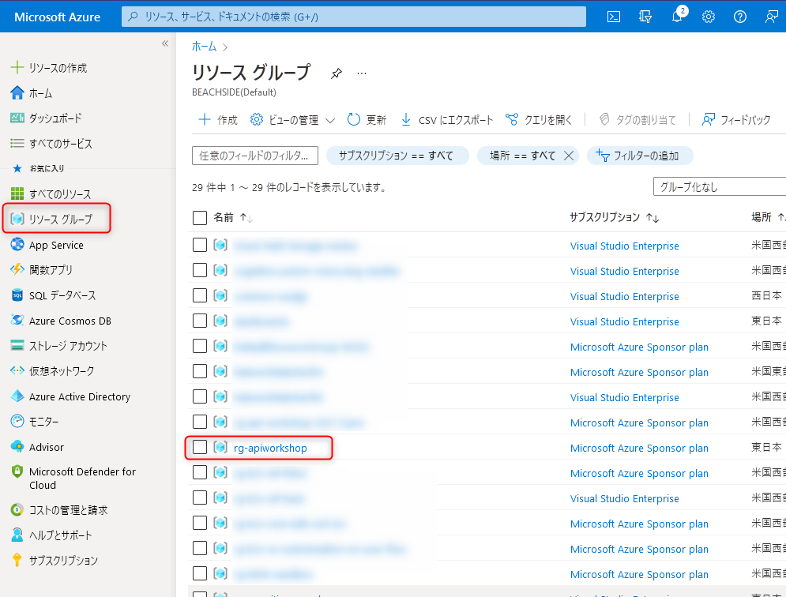

上部にある **作成** をクリックします。

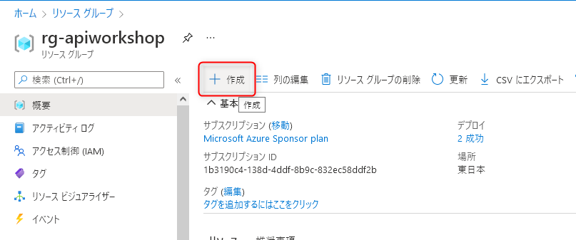

ストレージアカウントの **作成** をクリックします。

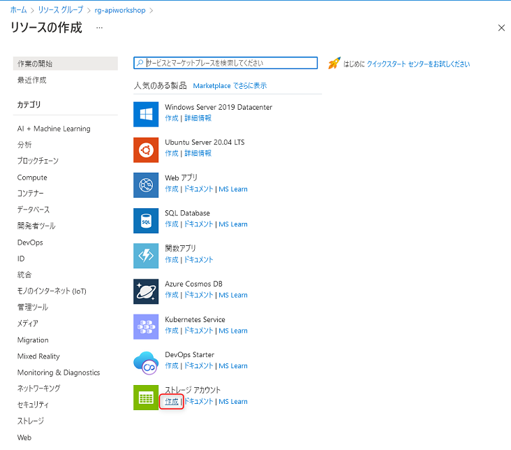


ストレージアカウントの作成画面が表示されますので、以下を参考に入力します。入力後、画面下部の **確認および作成** をクリックします。

- **サブスクリプション**: 任意のサブスクリプションを選択します。
- **リソースグループ**: `rg-apiworkshop` を選択します。
- **ストレージアカウント名**: 任意の名称を入力します。グローバルで一意になる必要があります。また、利用できる文字がアルファベット小文字と数字で24文字以内なので注意です。
- **地域**: 任意の場所を選択します。関東から最寄りのリージョンは`東日本` です。
- **冗長性**: `ローカル冗長ストレージ (LRS)` を選択します。

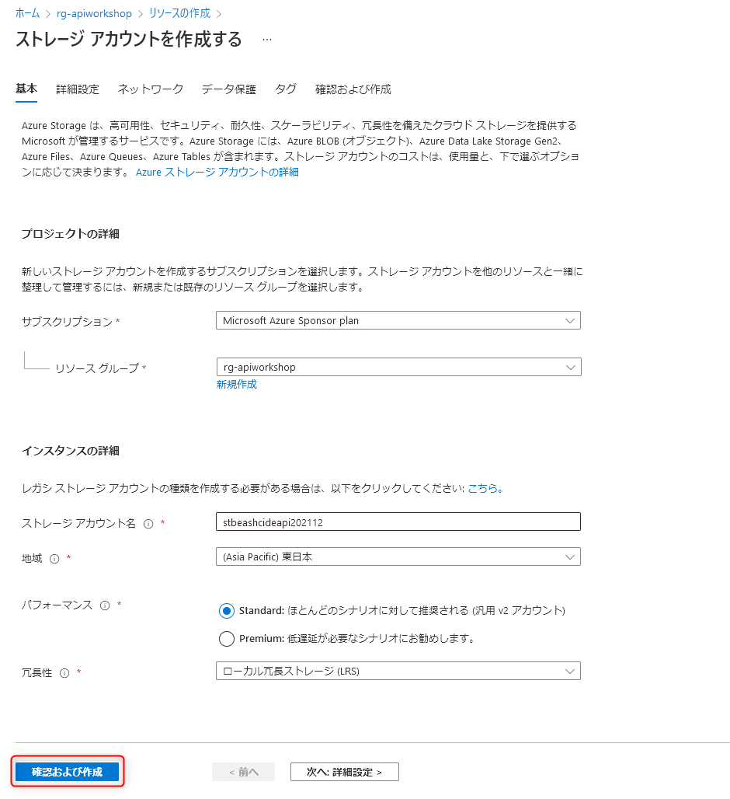

エラーが無ければ **作成** ボタンをクリックします。エラーがある場合は、入力内容を確認して修正します。

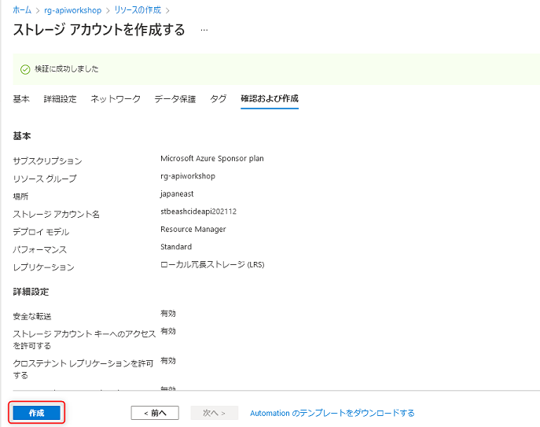

リソースの作成は通常30秒程度で完了します。完了したら **リソースに移動** ボタンをクリックします。

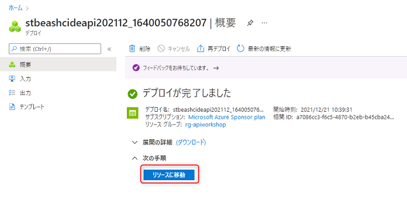

作成したストレージアカウントが表示されます。

左側のメニューで **コンテナー** をクリックし、上部に表示さる**+ コンテナー** (コンテナーの作成ボタン)をクリックします。

新しいコンテナーの作成ブレードが表示されますので、名前に「**images**」と入力し、**作成** ボタンをクリックします。

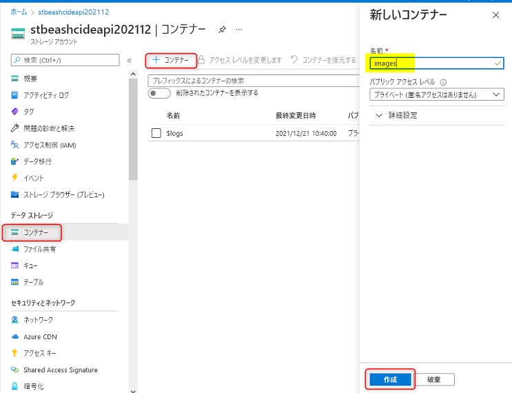

同様の手順で、「**csv**」という名前でコンテナーを作成します。

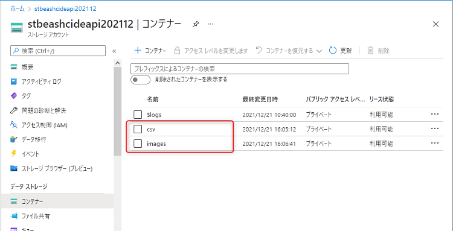

- 参考ドキュメント: [Azure Blob Storage とは](https://docs.microsoft.com/ja-jp/azure/storage/blobs/storage-blobs-overview)

<br>

## ステップ 2. CSV ファイルを保存する API

HTTP request の body に含まれている CSV の文字列を、CSV ファイルとして Blob へ保存する API を作成します。（画像やファイルを受け取って Blob へ保存する API はステップ 3 で作成します。

### NuGet パッケージのインストール

Blob の出力バインド機能を利用するために必要な NuGet パッケージをインストールします。

Visual Studio の上部にある検索で「nuget」と入力し、**NuGet パッケージの管理** をクリックします。

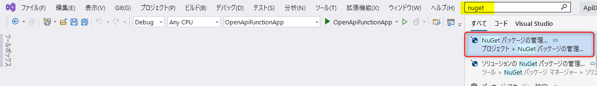

左上の **参照** タブをクリックします。検索に「Microsoft.Azure.WebJobs.Extensions.Storage」と入力し、同名のパッケージをインストールします。バージョンは最新の安定版です。

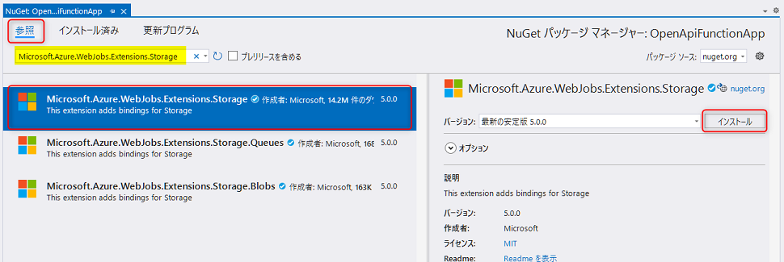

### Nuget パッケージのアップデート

**更新プログラム** タブを開くと、**Microsoft.Azure.WebJobs.Extensions.OpenApi** のアップデートが可能になっています。最新の安定版のバージョンに更新しましょう。

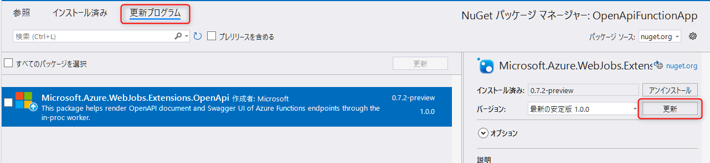


### API の作成

まず class を追加します。ソリューションエクスプローラーでプロジェクト名を右クリック → **追加** → **クラス** をクリックします。

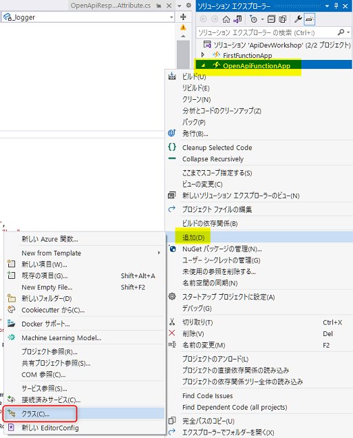

名前に 「**BlobOperations**」と入力し、**追加** ボタンをクリックします。

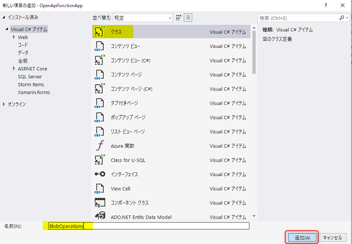

BlobOperations.cs のコード全体を、以下のコードに書き換えましょう。Azure Functions の中でも特徴的な機能のひとつである バインディングの機能を利用することで、メソッド内で blob へ保存処理は 1 行のみです。

> 📢 コードの詳細の解説は、ワークショップにて行います。

```csharp
using Microsoft.AspNetCore.Http;
using Microsoft.AspNetCore.Mvc;
using Microsoft.Azure.WebJobs;
using Microsoft.Azure.WebJobs.Extensions.Http;
using Microsoft.Azure.WebJobs.Extensions.OpenApi.Core.Attributes;
using Microsoft.Extensions.Logging;
using Microsoft.OpenApi.Models;
using System.IO;
using System.Net;
using System.Threading.Tasks;

namespace OpenApiFunctionApp;

public class BlobOperations
{
    private readonly ILogger<BlobOperations> _logger;

    public BlobOperations(ILogger<BlobOperations> log)
    {
        _logger = log;
    }

    [FunctionName("csv")]
    [OpenApiOperation(operationId: "SaveCsvToBlobAsync", tags: new[] { "Blob operations" }, Summary = "CSV の保存", Description = "Request body に含まれているテキストを Blob へ保存します。")]
    [OpenApiParameter(name: "name", In = ParameterLocation.Path, Required = true, Type = typeof(string), Description = "保存するファイル名を入力 (拡張子は不要)")]
    [OpenApiRequestBody(contentType: "text/csv", bodyType: typeof(string), Description = "保存する CSV を入力", Required = true)]
    [OpenApiResponseWithBody(statusCode: HttpStatusCode.Created, contentType: "text/plain", bodyType: typeof(string), Description = "保存した csv のファイル名")]
    public async Task<IActionResult> SaveCsvToBlobAsync (
        [HttpTrigger(AuthorizationLevel.Anonymous, "post", Route = "csv/{name}")] HttpRequest req,
        string name,
    [Blob("csv/{name}.csv", FileAccess.Write, Connection = "BlobConnectionString")] Stream output)
    {
        // body のデータをBlob へ保存
        await req.Body.CopyToAsync(output);
        return new ObjectResult($"{name}.csv を保存しました。")
        {
            StatusCode = StatusCodes.Status201Created
        };
    }
}
```

次に保存先の Blob の接続文字列の設定を行います。`Blob` attribute の `Connection` プロパティに `BlobConnectionString` と設定していますが、これは環境変数のキー名になります。

local.settings.json を開き、以下のように `BlobConnectionString` を追加します。

```json
{
  "IsEncrypted": false,
  "Values": {
    "AzureWebJobsStorage": "UseDevelopmentStorage=true",
    "FUNCTIONS_WORKER_RUNTIME": "dotnet",
    "BlobConnectionString": "" 
  }
}
```

`BlobConnectionString` にセットする値を取得するために、ブラウザーで Azure ポータルからストレージアカウントを開きます。左側のメニューで **アクセスキー** をクリックし、上部の **キーの表示** をクリックして接続文字列をコピーします。

Visual Studio に戻り、local.settings.json の`BlobConnectionString` にセットします。これで、ローカルデバッグ時でも、Azure 上の Blob にファイルが保存されます。


> 💡 `Blob` attribute で `Connection` プロパティを指定しないことで、デフォルト値である `AzureWebJobsStorage` がセットされ、デバッグ実行を全てローカル環境で動作させることも可能です。その場合、動作確認のために [Storage Exlorer](https://azure.microsoft.com/ja-jp/features/storage-explorer/) のインストールや操作が必要になるので、今回は Azure 上の Blob に設定します。

### ローカルデバッグで CSV をアップロードしてみる

デバッグ実行して、Swagger UI ( `localhost:7071/api/swagger/ui` ) を確認してみましょう。今作成した API が追加されていますので、実行してみましょう。 **Request body** には適当な CSV のデータを入力します。

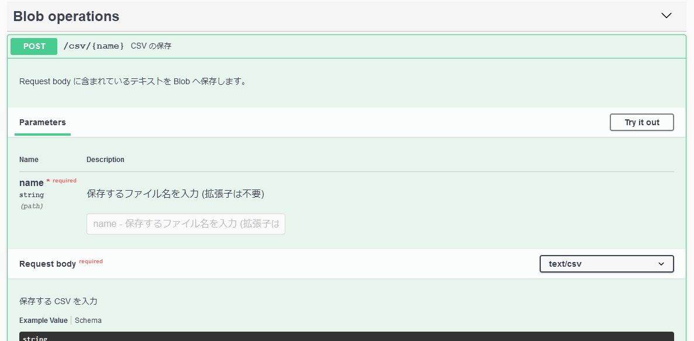

レスポンスが正常 (201) に返ってきたら、Azure ポータルで Blob のリソースを開いて確認します。左側のメニューで **コンテナー** をクリックし、**csv** コンテナーをクリックします。

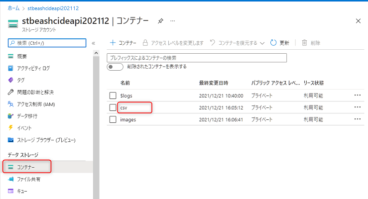

デバッグ実行が正常に処理されていれば、ファイルが存在しますのでクリックします。

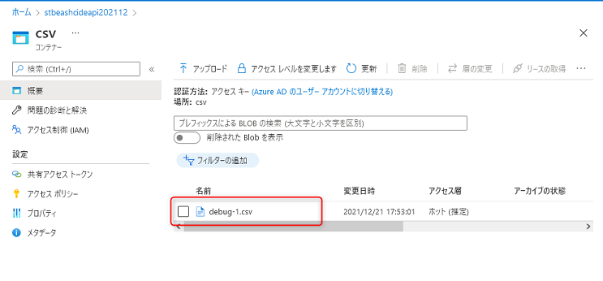

**編集** をクリックして、アップロードされたファイルの中を確認することができます。

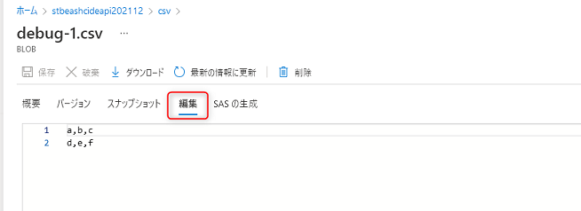

- 参考ドキュメント: [Azure Functions における Azure Blob Storage の出力バインド | Microsoft Docs](https://docs.microsoft.com/ja-jp/azure/azure-functions/functions-bindings-storage-blob-output?tabs=csharp)

<br>

## ステップ3. 画像を保存する API の作成

HTTP request に含まれている画像データを Blob へ保存する API を作成します。画像ではなく、CSV ファイルといったデータでも同様に保存ができます。

先ほど同様に Blob の出力バインディングを使った実装を行います。

※ ここで紹介する方法は、今後よりよい方法に変わる可能性がある点にご注意ください。

### API の追加

まず、`Models` フォルダーの直下に `MultiPartFormDataMode` class を追加し、コード全体は以下にします。

```csharp
namespace OpenApiFunctionApp.Models;

public class MultiPartFormDataModel
{
    public byte[] Image { get; set; }
}
```

次に BlobOperations.cs で以下の `SaveImageToBlobAsync` メソッドを追加します。`using` ステートメントは必要に応じて追加してください。

> 📢 コードの詳細の解説は、ワークショップにて行います。

```csharp
    [FunctionName("image")]
    [OpenApiOperation(operationId: "SaveImageToBlobAsync", tags: new[] { "Blob operations" })]
    [OpenApiParameter(name: "name", In = ParameterLocation.Path, Required = true, Type = typeof(string), Description = "保存するファイル名 (拡張子無し)")]
    [OpenApiParameter(name: "extension", In = ParameterLocation.Path, Required = true, Type = typeof(string), Description = "ファイルの拡張子")]
    [OpenApiRequestBody(contentType: "multipart/form-data", bodyType: typeof(MultiPartFormDataModel), Description = "アップロードする画像", Required = true)]
    [OpenApiResponseWithBody(statusCode: HttpStatusCode.Created, contentType: "text/plain", bodyType: typeof(string), Description = "保存したファイル名")]
    public async Task<IActionResult> SaveImageToBlobAsync(
        [HttpTrigger(AuthorizationLevel.Anonymous, "post", Route = "images/{name}/{extension}")] HttpRequest req,
        string name, string extension,
        [Blob("images/{name}.{extension}", FileAccess.Write, Connection = "BlobConnectionString")] Stream output)
    {
        var uploadedFile = req.Form.Files[0];
        await uploadedFile.CopyToAsync(output);

        return new ObjectResult($"{name}.{extension} を保存しました。")
        {
            StatusCode = StatusCodes.Status201Created
        };
    }
```

### ローカルデバッグで CSV を画像をアップロードしてみる

デバッグ実行して、Swagger UI ( `localhost:7071/api/swagger/ui` ) を確認してみましょう。今作成した API が追加されています。Request body で画像やファイルをアップロードできるようになっていますので、動作確認をしてみましょう。

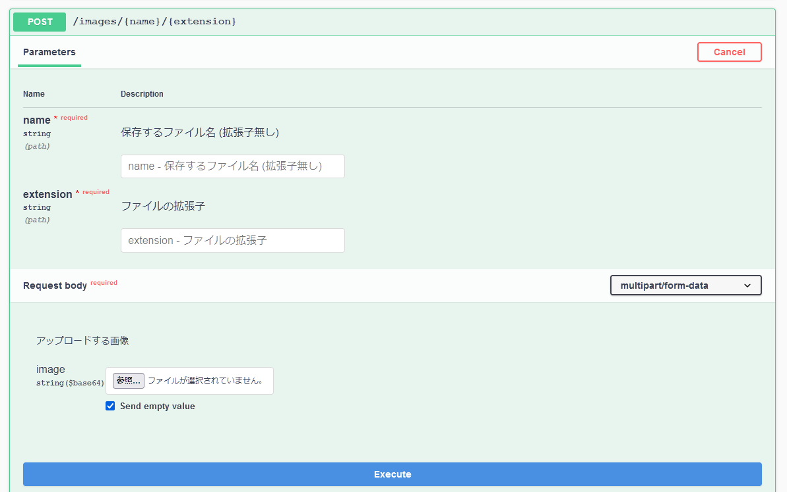

レスポンスが正常 (201) に返ってきたら、Azure ポータルで Blob のリソースを開いて確認します。

レスポンスが正常 (201) に返ってきたら、Azure ポータルで Blob のリソースを開いて確認します。左側のメニューで **コンテナー** をクリックし、**images** コンテナーをクリックします。

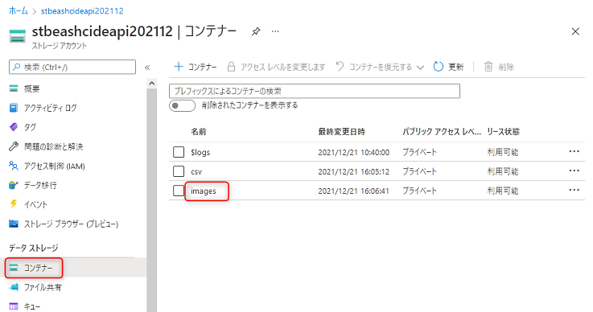


デバッグ実行が正常に処理されていれば、ファイルが存在しますのでクリックします。

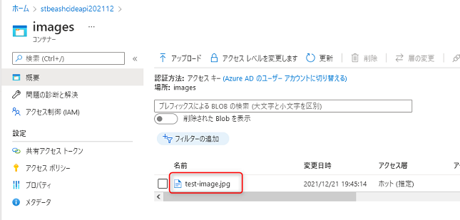

**編集** をクリックして、ファイルの中を確認することができます。

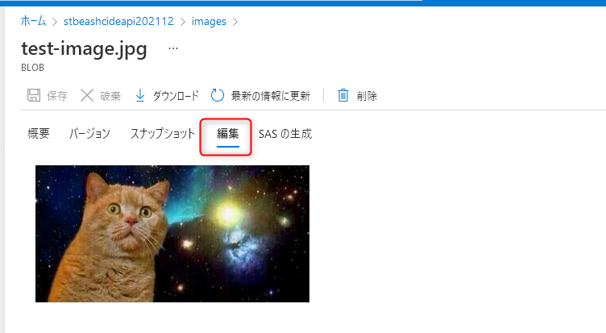


- 参考ドキュメント: [azure-functions-openapi-extension の開発者本人のブログ記事](https://devkimchi.com/2021/10/27/transmitting-binary-data-via-openapi-on-azure-functions/)

<br>

## ステップ 3. Azure へデプロイして動作確認

Azure へデプロイして動作を確認してみましょう。

### Function App の環境変数に接続文字列をセットする

保存先の Blob の接続文字列は、Function App にも設定する必要があります。

Azure ポータルで Function App のリソースを開きましょう。左側のメニューで **構成** をクリックし、**新しいアプリケーション設定** をクリックします。

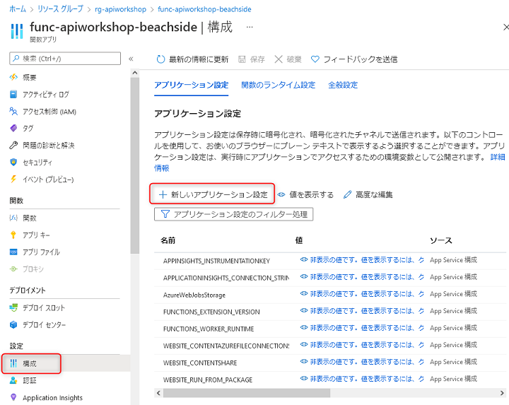

以下を参考に入力し、**OK**ボタンをクリックします。

- **名前**:`BlobConnectionString`
- **値**: 保存先の Blob の接続文字列 (local.settings.json にもセットした値)

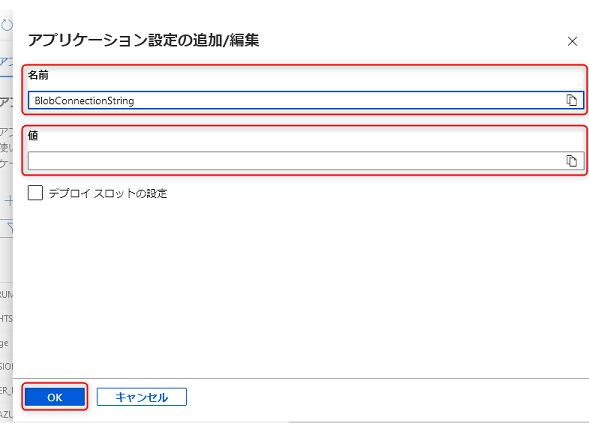

最後に画面上部の **保存** ボタンをクリックします。忘れると保存されませんのでご注意ください。

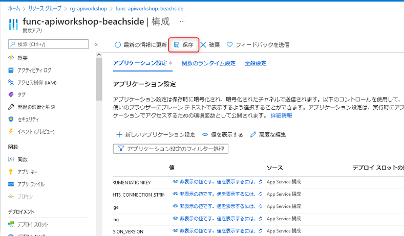


### デプロイして動作確認

Visual Studio から Azure の Function App へデプロイしてみましょう。ソリューションエクスプローラーでプロジェクト名を右クリックし、**発行** をクリックします。

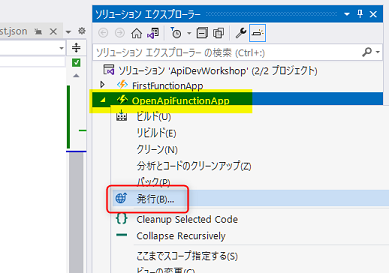

先ほど作成した発行プロファイルが表示されます。**発行** ボタンをクリックして、デプロイを実行します。

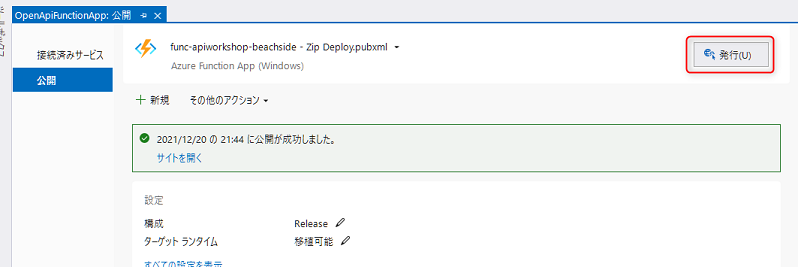

デプロイが完了したら、Azure 上の Function App にデプロイされた Swagger UI を開いて API の動作確認、Blob へアップロードしたファイルを確認してみましょう。

Function App の Swagge UI の URL が不明な場合は、 以下を参考に開きましょう。

> Azure ポータルの Function App のリソースを開き左側のメニューにある **概要** をクリックすると、Function App の URL が確認できます。クリックしてみましょう。
>
> 
>
> デフォルトのトップ画面が表示されます。
>
> 
>
> URL の後ろに `/api/swagger/ui` と入力して画面を表示すると、先ほど作成した Swagger UI が確認できます。


## 🎉 Congratulations 🎉

ここでは以下を習得しました。

- ✅ Azure Storage Account の作成
  - Azure ポータルからの Storage Account の作成方法
- ✅ CSV ファイルを保存する API の作成
- ✅ 画像を保存する API の作成
- ✅ Azure 上での動作確認
  - Blob の確認方法

最後に、今回のワークショップで作成した Azure のリソースを一括削除する方法をご紹介します。

<br>

[戻る](./deploy-to-azure.md) | [**次へ: Azure のリソース削除**](./delete-azure-resources.md)

----

[目次へ戻る](./selfpaced-handson.md)
