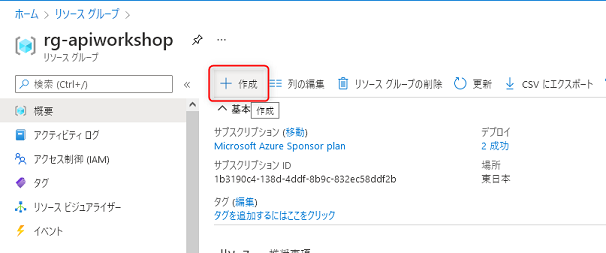
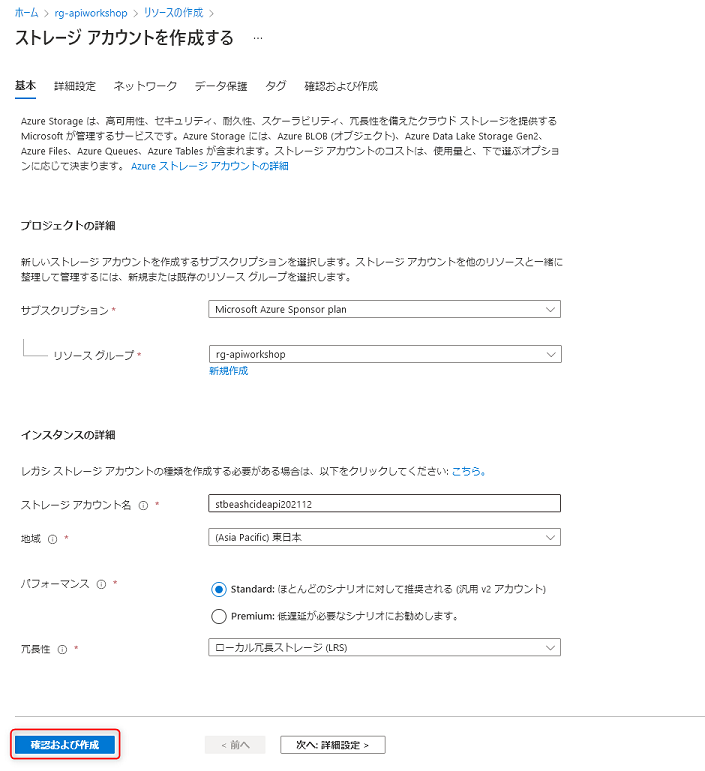

# Azure Storage へファイルを保存する API の作成

ここでは、Http trigger の Function App で、Azure Storage の blob へファイルを保存する API を開発します。

Blob への保存処理は、出力バインドの機能を使うことで、コードを最小限に抑えて実装します。

TODO: 追記

## Azure Storage アカウントの作成

Azure ポータルから Storage アカウントを作成します。

Azure ポータル `https://portal.azure.com` を開き、先ほど作成したリソースグループ `rg-apiworkshop` を開きます。

上部にある **作成** をクリックします。

ストレージアカウントの **作成** をクリックします。

ストレージアカウントの作成画面が表示されますので、以下を参考に入力します。入力後、画面下部の **確認および作成** をクリックします。

- サブスクリプション: 任意のサブスクリプションを選択します。
- リソースグループ: `rg-apiworkshop` を選択します。
- ストレージアカウント名: 任意の名称を入力します。グローバルで一意になる必要があります。また、アルファベット小文字と数字で24文字以内です。
- 地域: 任意の場所を選択します。関東から最寄りのリージョンは`東日本` です。
- 冗長性: `ローカル冗長ストレージ (LRS)` を選択します。

エラーが無ければ **作成** ボタンをクリックします。エラーがある場合は、入力内容を確認して修正します。

リソースの作成は通常30秒程度で完了します。完了したら **リソースに移動** ボタンをクリックします。

作成したストレージアカウントのリソースが表示されます。左側のメニュー **コンテナー** をクリックし、上部に表示さる**+ コンテナー** (コンテナーの作成ボタン)をクリックします。

新しいコンテナーの作成ブレードが表示されますので、名前に「**images**」と入力し、**作成** ボタンをクリックします。

## CSV の保存する API

## 画像を保存する API

## Azure へデプロイして動作確認

### 接続文字列をセットする

### デプロイして動作確認

## まとめ

ワークショップの最後に、今回のワークショップで作成した Azure のリソースを一括削除する方法をご紹介します。

 

[**次へ: Azure のリソース削除**](./delete-azure-resources.md)

----

[目次へ戻る](./selfpaced-handson.md)

