# Open API を適用した Azure Functions の開発

ここでは Azure Functions で Open API 定義のドキュメントを生成する方法を学びます。

- [ ] Open API エンドポイントが有効な Azure Functions の作成
- [ ] Function App での Open API の定義方法


## ステップ 1. Open API エンドポイントが有効な Azure Functions の作成

ここでは、Azur Functions の API 作成時に Open API の定義のエンドポイントも生成する方法を学びます。

### プロジェクトの作成

Visual Studio のソリューションエクスプローラーで、前のワークショップで作成したソリューション名を右クリック → **追加** → **新しいプロジェクトの作成** をクリックします。

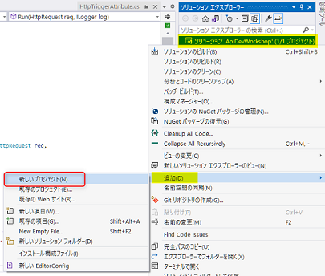

Azure Functions (C#) をクリックします。見つからない場合は、上部の検索で「Azure Functions」と入力すると表示されます。

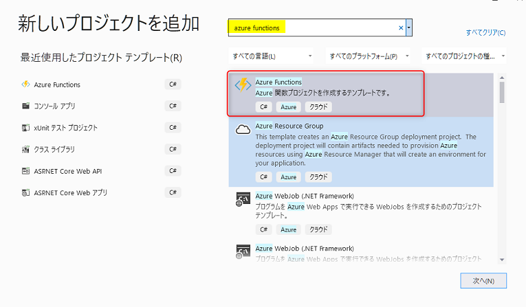

プロジェクト名に「OpenApiFunctionApp」と入力し、**作成**ボタンをクリックします。

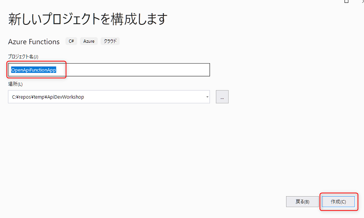

以下を参考に設定し、**作成** ボタンをクリックします。

- ウインドウ上部が **.NET 6** になっていることを確認します。
- テンプレートは、**Http trigger with OpenAPI** を選択します。
- ウインドウ右側の Authorization level は **Anonymous** を選択します。

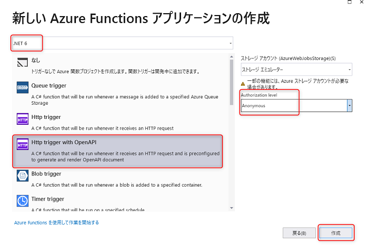

生成されたメソッドの中のコードは、前チャプターで作成したコードとほとんど変わりませんが、Open API の定義用に Attribute がたくさんついています。これについては後ほど説明ます。

### デバッグ実行して Open API のエンドポイントを確認する

どんな Open API の画面が生成されているのか確認してみましょう。

まず、ウインドウ上部のプロジェクトを「OpenApiFunctionApp」に変更します。デバッグの開始は `F5` キーを押すか、ウインドウ上部の **デバッグの開始** ボタンをクリックします。

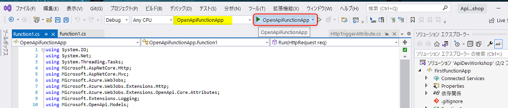

コンソールが起動します。前チャプターでデバッグしたときとは異なり、複数のエンドポイントが表示されています。

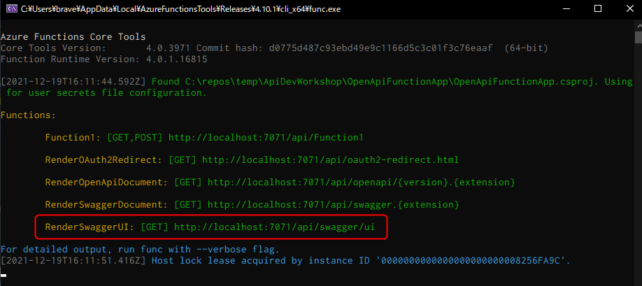

ブラウザーで`http://localhost:7071/api/swagger/ui` にアクセスしてみましょう。以下の画面が表示されます。

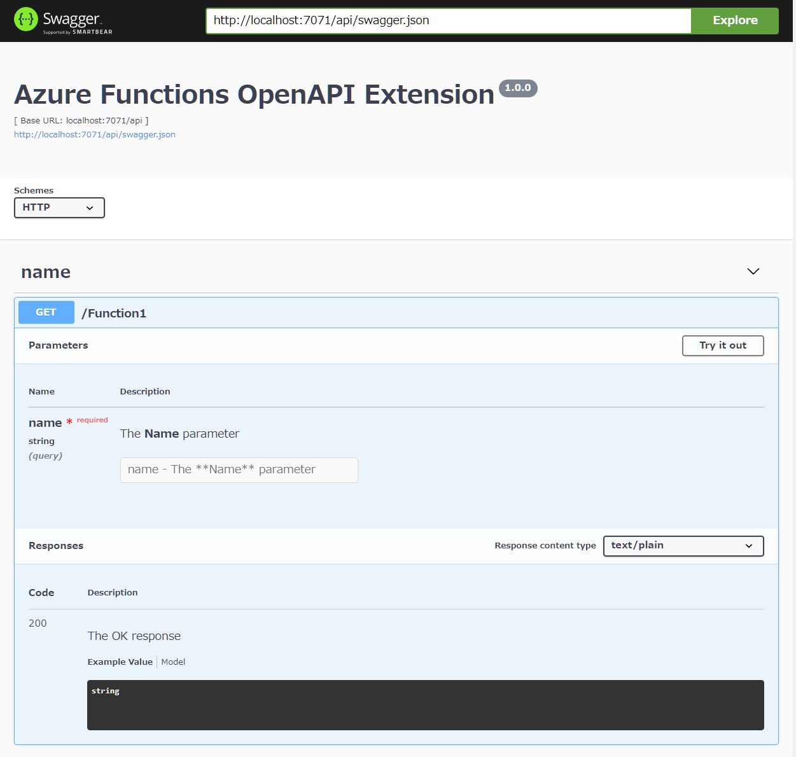

`http://localhost:7071/api/swagger.json` や `http://localhost:7071/api/swagger.yaml` にアクセスすることで定義を直接みることが可能です。

次は、UI を構成するコードの解説と、Open API の Metadata のカスタマイズをしていきます。

<br>

## ステップ2. Function App での Open API の定義方法

ここでは、 Open API エンドポイントが有効な Azure Functions の基本的なしくみを学びます。

### Open API を定義する Attribute の構成

メソッドの上に複数定義されている `OpenApi...` の Attribute を設定することで、Open API の定義を構成することができます。

> 📢 コードの詳細の解説は、ワークショップにて行います。

```csharp
    [FunctionName("Function1")]
    [OpenApiOperation(operationId: "Run", tags: new[] { "name" })]
    [OpenApiParameter(name: "name", In = ParameterLocation.Query, Required = true, Type = typeof(string), Description = "The **Name** parameter")]
    [OpenApiResponseWithBody(statusCode: HttpStatusCode.OK, contentType: "text/plain", bodyType: typeof(string), Description = "The OK response")]
    public async Task<IActionResult> Run(
        [HttpTrigger(AuthorizationLevel.Anonymous, "get", "post", Route = null)] HttpRequest req)
```

### Open API のカスタマイズ

ここでは Open API の Metadata (Open API の [Info Object](https://github.com/OAI/OpenAPI-Specification/blob/main/versions/3.0.1.md#infoObject)) のカスタマイズ方法を説明します。

簡単にいうと、主に Swagger UI の赤枠の部分のカスタマイズと思っていただいて問題ありません。

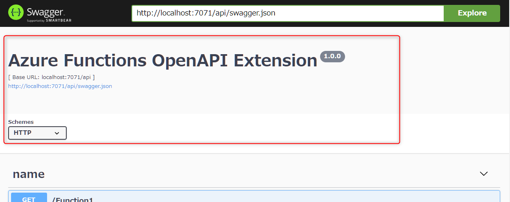

SDK で専用の class が用意されているのでそれを使ってカスタマイズしていきます。Visual Studio のソリューションエクスプローラーでプロジェクト名を右クリック → **追加** → **クラス** をクリックします。

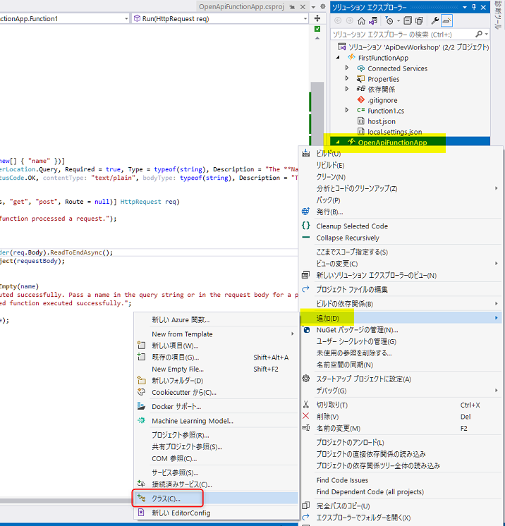

クラス名に「OpenApiConfigurationOptions」と入力し、**追加** ボタンをクリックします。

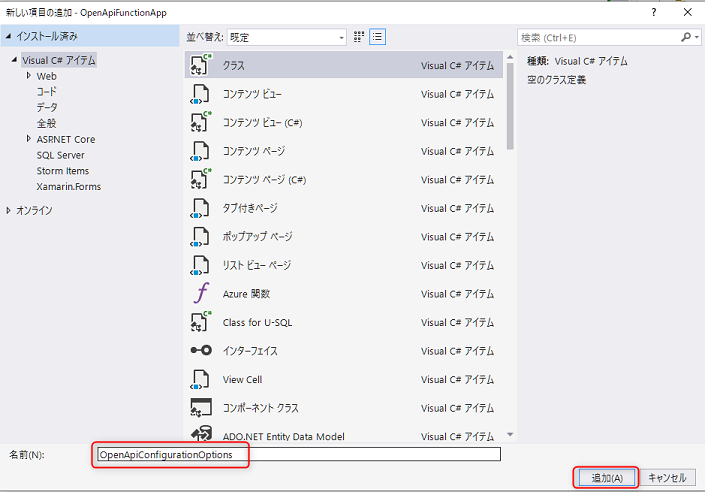

OpenApiConfigurationOptions class のコード全体を以下に書き換えます。

```csharp
using System;
using Microsoft.Azure.WebJobs.Extensions.OpenApi.Core.Configurations;
using Microsoft.Azure.WebJobs.Extensions.OpenApi.Core.Enums;
using Microsoft.OpenApi.Models;

namespace OpenApiFunctionApp;

public class OpenApiConfigurationOptions : DefaultOpenApiConfigurationOptions
{
    public override OpenApiInfo Info { get; set; } = new()
    {
        Version = "v1.0.0-preview",
        Title = "API Development workshop API definition",
        Description = "Powered by ZEN ARCHITECTS.",
        License = new OpenApiLicense()
        {
            Name = "MIT",
            Url = new Uri("http://opensource.org/licenses/MIT"),
        }
    };

    public override OpenApiVersionType OpenApiVersion { get; set; } = OpenApiVersionType.V3;
}
```

デバッグ実行して、カスタマイズした内容を確認してみましょう。

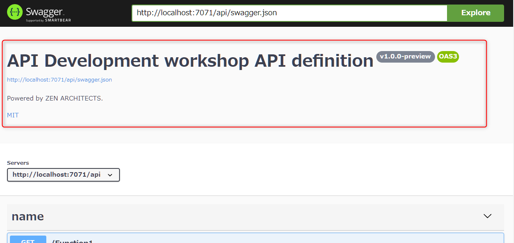


ここでは最小限の内容を変更しました。その他の項目のカスタマイズは以下のドキュメントに記載されています。

- [OpenAPI Metadata Configuration - Azure/azure-functions-openapi-extension](https://github.com/Azure/azure-functions-openapi-extension/blob/main/docs/openapi-core.md#openapi-metadata-configuration) 

<br>

## 🎉 Congratulations 🎉

ここでは以下のことを習得しました。

- ✅ Open API エンドポイントが有効な Azure Functions の作成
  - Visual Studio で Http trigger with Open API の Function App の作成方法
- ✅ Function App での Open API の定義方法
  - Open API を定義する Attribute の構成
  - Open API の Metadata のカスタマイズ方法

次のチャプター以降では、実戦的な内容として GET / POST / PUT / DELETE の API の開発とメソッドに合わせた Open API の定義方法を学びます。

<br>

[戻る](./create-function-app.md) | [**次へ: 実践的な GET メソッドの作成**](./create-get-methods.md)

----

[目次へ戻る](./selfpaced-handson.md)
