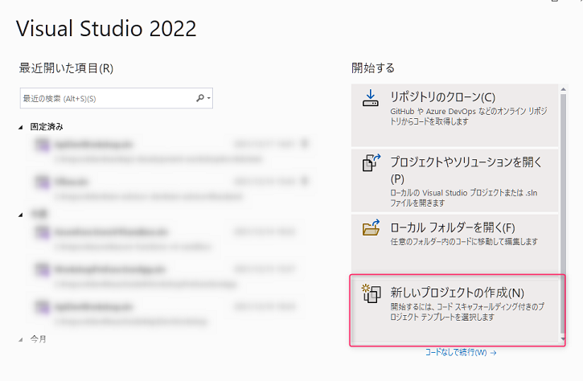
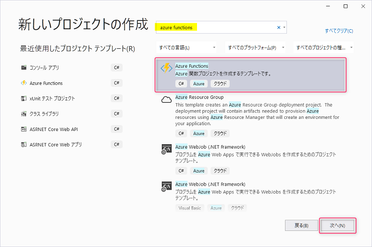
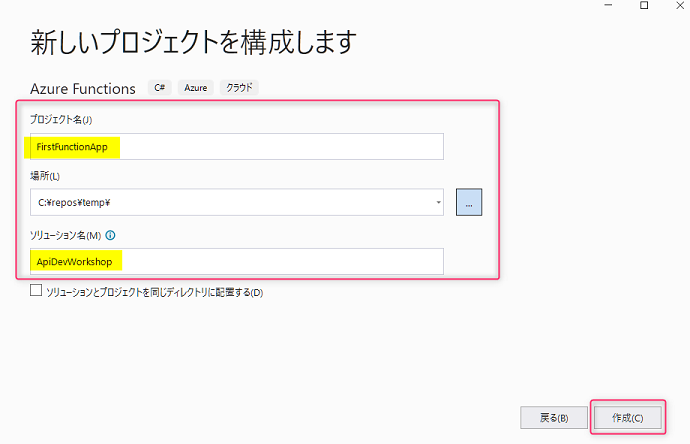
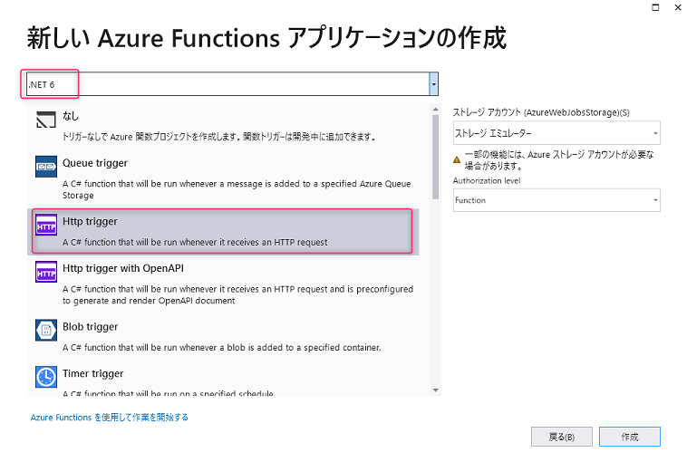
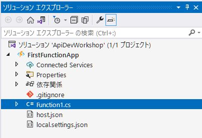
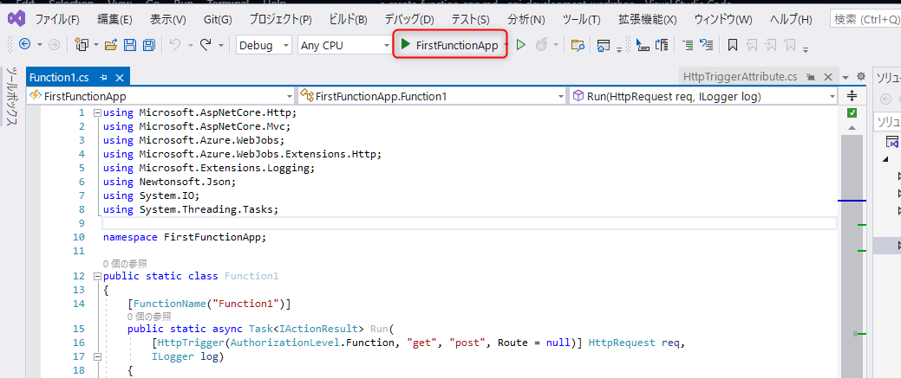
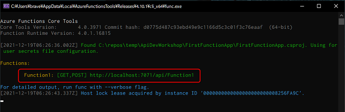

# Azure Functions での API 開発の第一歩

ここでは Azure Functions で API の開発をする第一歩として、以下のことを学びます。

- [ ] REST API の作成
- [ ] Azure Functions のプロジェクト構成
- [ ] ローカルデバッグ

<br>

## ステップ 1. REST API の作成

ここでは、HTTP のプロトコルを受け取る Azure Functions のプログラムを開発の方法を学んでいきましょう。

Visual Studio 2022 を起動し、**新しいプロジェクトの作成** をクリックします。



Azure Functions (C#) のテンプレートを選択し、右下の **次へ** をクリックします。テンプレートが見つからない場合は、上部の検索で 「azure functions」と入力すると見つけやすいです。



以下を参考に入力し、**作成**ボタンをクリックします。

- **プロジェクト名**: `FirstFunctionApp`
- **場所**: 任意の場所を選択
- **ソリューション名**: `ApiDeWorkshop`



ウインドウ上部のバージョンは、`.NET 6` を選択します。トリガーは `Http trigger` を選択します。**作成** ボタンをクリックするとプロジェクトの作成が始まります。



<br>

## ステップ 2. Azure Functions のプロジェクト構成

ここでは、テンプレートから作成された Function App のファイル構成とコードの基本を理解していきます。

### ファイル構成

Azure Functions のプロジェクトは、ソリューションエクスプローラーで見ると以下図のように構成されています。



最初に知っておくべきファイルは以下の 3 つです。

| ファイル名 | 概要 |
| ----------------------- | -----------------------------|
| **Function1.cs** | Http trigger のコードが書かれています。この詳細は後ほど解説します。 |
| **host.json** | Azure Functions のインスタンスの構成オプションを定義するファイルです。 |
| **local.settings.json** | ローカル環境でデバッグ実行時に環境変数を定義するためのファイルです。このファイルは Azure Functions のプロジェクト直下にある .gitignore に定義されているファイルなので、コード管理対象外です。 |

参考までに host.json に関するドキュメントはこちらです。

- [Azure Functions 2.x 以降の host.json のリファレンス](https://docs.microsoft.com/ja-jp/azure/azure-functions/functions-host-json)
- [host.json の設定 - Azure Functions での HTTP 出力バインド | Microsoft Docs](https://docs.microsoft.com/ja-jp/azure/azure-functions/functions-bindings-http-webhook-output#hostjson-settings)


### 生成されたコードを見てみる

Function1.cs を見てみましょう。以下のコードが生成されています。メソッド内では、以下の処理が書かれています。

- URL に含まれている Query string の値取得
- request body から JSON のデータ取得
- HTTP status code 200 でのレスポンス生成

> 📢 詳細の解説は、ワークショップにて行います。


```csharp
public static class Function1
{
    [FunctionName("Function1")]
    public static async Task<IActionResult> Run(
        [HttpTrigger(AuthorizationLevel.Function, "get", "post", Route = null)] HttpRequest req,
        ILogger log)
    {
        log.LogInformation("C# HTTP trigger function processed a request.");

        string name = req.Query["name"];

        string requestBody = await new StreamReader(req.Body).ReadToEndAsync();
        dynamic data = JsonConvert.DeserializeObject(requestBody);
        name = name ?? data?.name;

        string responseMessage = string.IsNullOrEmpty(name)
            ? "This HTTP triggered function executed successfully. Pass a name in the query string or in the request body for a personalized response."
            : $"Hello, {name}. This HTTP triggered function executed successfully.";

        return new OkObjectResult(responseMessage);
    }
}
```

- 参考: [Azure Functions の HTTP トリガー](https://docs.microsoft.com/ja-jp/azure/azure-functions/functions-bindings-http-webhook-trigger?tabs=csharp)

<br>

## ステップ 3. ローカルデバッグ

ここでは Function App のローカルデバッグ方法を学びます。

デバッグを開始する前に、ブレークポイントを適当な箇所に置くことでステップ実行が可能になります。ステップ実行で動きを確認したい場合は置いてみましょう。

デバッグの開始は `F5` キーを押すか、ウインドウ上部の **デバッグの開始** ボタンをクリックします。



コンソールが起動し、エントリーポイントが表示されます。Postman を使って、GET や POST で `name` をしてリクエストを送信して動作を確認してみましょう。



<br>

## 🎉 Congratulations 🎉

ここでは以下のことを習得しました。

- ✅ **REST API の作成**
  - Visual Studio で Http Trigger の Function App の作成方法
- ✅ **Azure Functions のプロジェクト構成**
  - Http Trigger で生成されるファイルの内容とエントリーポイントのコードの理解
- ✅ **ローカルデバッグ**
  - デバッグ実行の方法と、ブレークポイントをおいてステップ実行する方法

次のチャプター以降で、Open API を適用した API の作成、そしてより実戦的な GET/POST/PUT/DELETE の API を作成していきます。

<br>

[戻る](create-first-http-client.md) | [**次へ: Open API を適用した Azure Functions の開発**](./create-function-app-with-open-api.md)

----

[目次へ戻る](./selfpaced-handson.md)
