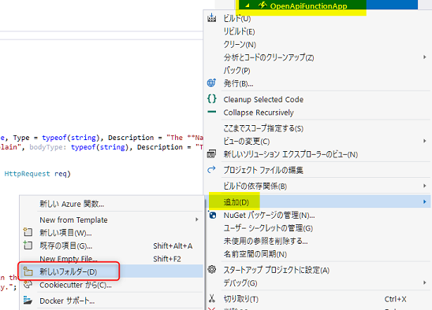
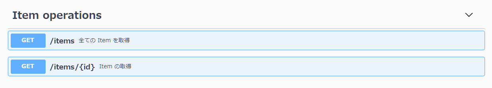

# 実戦的な GET メソッドの作成

ここでは RESTful な API の開発の実践として、前半のワークショップで操作した `Item` というデータを操作する API を開発していきます。

ここでは GET メソッドの API の開発の基礎を学びます。

- [ ] 開発に入る前の準備 (POCO の追加、データの初期化)
- [ ] GET の API 開発 (動詞の指定、Route の定義方法)

なお、サンプルコード内の入力チェックや処理の共通化などはワークショップの本質からはずれるので、簡易なコードで構成しています。

<br>

## ステップ 1. 開発に入る前の準備

今回のワークショップではデータストアとの連携は行いませんので、データを内部で保持してメソッドに応じたデータを返せるようにします。

### POCO の作成

まずデータの POCO となる class を追加していきます。Visual Studio のソリューションエクスプローラーでプロジェクト名を右クリック → **追加** → **新しいフォルダー** をクリックします。フォルダー名は「Models」で登録します。




作成した **Models** フォルダーを右クリックし class を追加しましょう。

1つ目は `ItemToAdd` という名前で class を追加します。コードは以下にします。

```csharp
namespace OpenApiFunctionApp.Models;

public class ItemToAdd
{
    public string Name { get; set; }
    public string Category { get; set; }
    public string Description { get; set; }
}
```

2つ目は、`Item` という名前で class を追加します。コードは以下にします。

```csharp
namespace OpenApiFunctionApp.Models;

public class Item : ItemToAdd
{
    public string Id { get; set; }
}
```

2つに分けたのは、Open API で表示される schema を明確に定義するためです。詳細は API を開発する際に Swagger UI を確認しながら説明します。

### Function1 のクラス名変更

`Function1` というクラス名だと責務が全くわかりませんので名前を変更するために、2つの操作を行います。

1つ目は、ソリューションエクスプローラーで、ファイル **Function1.cs** のファイル名を **ItemOperations.cs** へ変更します。


2つ目は、ItemOperations.cs を開いて、class 名を `Function1` から `ItemOperations` へ変更します。変更に伴い ILogger のジェネリクスとコンストラクターの名称も変更します。具体的には以下のコードになります。

```csharp
public class IemOperations
{
    private readonly ILogger<IemOperations> _logger;
    public IemOperations(ILogger<IemOperations> log)
    {
        _logger = log;
    }
// 以下省略
```

### データの初期化

Function App 起動時に static な変数として初期化します。**IemOperations.cs** で、class の変数として以下のように定義します。必要に応じて `using` ステートメントは追加してください。


```csharp
namespace OpenApiFunctionApp;

public class IemOperations
{
    private readonly ILogger<IemOperations> _logger;
    private static readonly List<Item> Items = Enumerable.Range(0, 5)
                                                .Select(x => new Item
                                                {
                                                    Id = x.ToString(),
                                                    Name = $"Item {x}",
                                                    Description = $"Description {x}",
                                                    Category = x % 2 == 0 ? "hat" : "bag"
                                                })
                                                .ToList();
```

これで準備は完了です。次は全データを取得する API と ID を指定して取得する API を開発してきます。

<br>

## ステップ 2. GET の API 開発

ItemOperations.cs にコードを書いて API を開発していきます。

### 全データを取得する API

ここでは、HTTP のメソッド (GET, POST など) を指定する方法を学びながら API を開発していきましょう。

既存の `Run` メソッドは削除し、以下のコードを追加します。以下コードのように`HttpTrigger` attribute の `methods` 引数を `get` のみを指定することで、GET のみでアクセスできる API になります。

ポイントは、指定した動詞のみアクセスできるようになることです。

> 📢 コードの詳細な解説は、ワークショップにて行います。

```csharp
    [FunctionName(nameof(GetItems))]
    [OpenApiOperation(operationId: nameof(GetItems), tags: new[] { "Item operations" }, Summary = "全ての Item を取得", Description = "登録されている全ての Item を取得します。API 起動時は id 0 ～ 4 の Item が登録されています。")]
    [OpenApiResponseWithBody(statusCode: HttpStatusCode.OK, contentType: "application/json", bodyType: typeof(List<Item>), Description = "登録されている全ての Item")]
    public IActionResult GetItems([HttpTrigger(AuthorizationLevel.Anonymous, "get", Route = "items")] HttpRequest req)
    {
        return new OkObjectResult(Items);
    }
```

### ID を指定して単一の Item を取得する API

ここでは、RESTful な API の慣例に合わせ、例えば `id: 1` の Item を取得したい場合は以下のようなパスでアクセスできる Routing の設定方法を学びます。

- `api/items/1`

Route の定義とその値の取得は、`HttpTrigger` attribute の `Route` を定義することで取得できます。  
以下コードのように `Route = "items/{id}"` と定義し、さらにメソッドの引数で `id` を定義することで、メソッド内で Route で取得した値を利用することが可能です。

> 📢 コードの詳細な解説は、ワークショップにて行います。

このコードを `IemOperations` class に追加しましょう。必要に応じて `using` ステートメントは追加してください。

```csharp
    [FunctionName(nameof(GetItem))]
    [OpenApiOperation(operationId: "GetItem", tags: new[] { "Item operations" }, Summary = "Item の取得", Description = "指定した id の item を取得します。")]
    [OpenApiParameter(name: "id", In = ParameterLocation.Path, Required = true, Type = typeof(string), Description = "取得したい Item の Id")]
    [OpenApiResponseWithBody(statusCode: HttpStatusCode.OK, contentType: "application/json", bodyType: typeof(Item), Description = "指定した Id の Item")]
    public IActionResult GetItem([HttpTrigger(AuthorizationLevel.Anonymous, "get", Route = "items/{id}")] HttpRequest req, string id)
    {
        var item = Items.FirstOrDefault(x => x.Id == id);
        if (item == null)
        {
            return new NotFoundObjectResult($"id: {id} のアイテムは存在しません。");
        }

        return new OkObjectResult(item);
    }
```

参考ドキュメントは以下になります。

- [HTTP エンドポイントのカスタマイズ - Azure Functions の HTTP トリガー | Microsoft Docs](https://docs.microsoft.com/ja-jp/azure/azure-functions/functions-bindings-http-webhook-trigger?tabs=csharp#customize-the-http-endpoint)


デバッグ実行して `http://localhost:7071/api/swagger/ui` を起動してみましょう。以下図のように 2 つの GET メソッドが追加されています。それぞれの API を実行して動作確認をしてみましょう。




### (オプション実習) Query String から検索してデータを返す API

前半のワークショップで試したような query string を使ったデータの検索もよくあるパターンです。

`category` を検索する API を作ってみましょう。

TODO: 作成例のコードサンプルは[こちら](????????????)

<br>

## まとめ

ここでは以下のことを学びました。


- ✅ 開発に入る前の準備 (POCO の追加、データの初期化)
- ✅ GET の API 開発
  - API ごとに動詞 (GET, POST など) を指定する方法
  - Route の指定方法と、その値をメソッド内で利用する方法

次のチャプターでは、POST / PUT / DELTE の API を開発します。

<br>

[**次へ: 実戦的な POST / PUT / DELETE メソッドの作成**](./create-methods.md)

----

[目次へ戻る](./selfpaced-handson.md)
