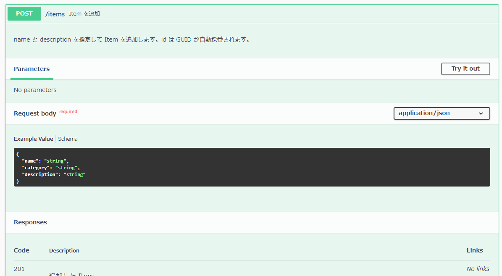
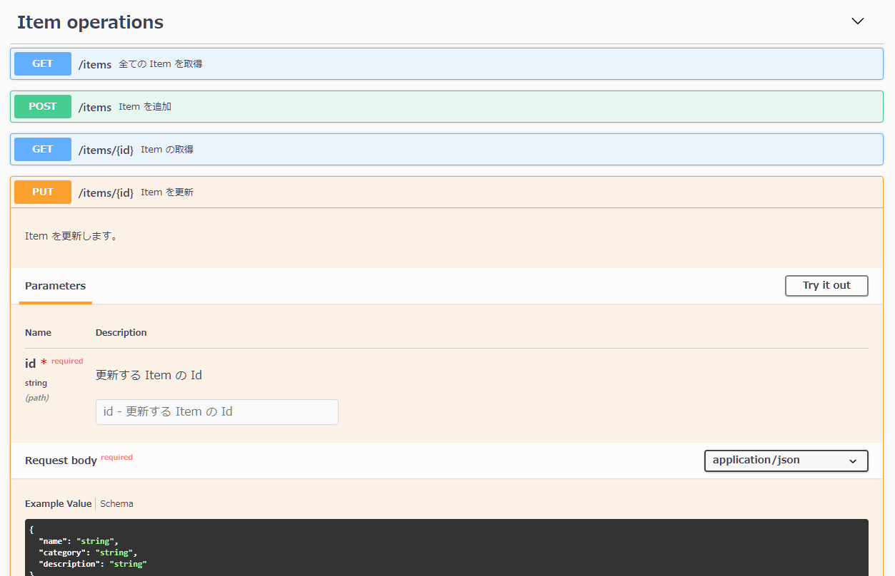
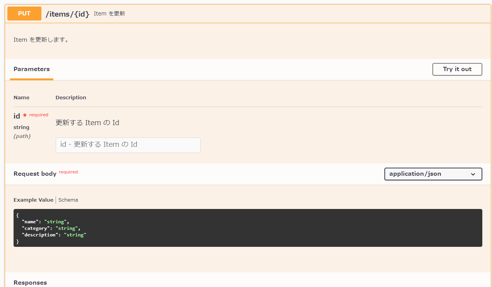

# 実践的な POST / PUT / DELETE メソッドの作成

ここでは以下の API を作成しながら`HttpTrigger` attribute の使い方や Open API の定義のパターンを学びます。

- [ ] POST の API 作成 - Item の新規追加
- [ ] PUT の API 作成 - Item の更新
- [ ] DELETE の API 作成 - Item の削除

なお、サンプルコード内の入力チェックや処理の共通化などはワークショップの本質からはずれるので、簡易なコードで構成しています。

<br>

## ステップ 1. POST の API 作成 - Item の新規追加

HTTP request method の **POST** は、主にリソースの追加時に使います。ここでは Item を新規に追加するメソッドを作成します。

API の主な仕様は以下とします。

- HTTP request method の `POST`
- パスは`api/items` とする。
- request の body でデータを受け取る。JSON フォーマットで `name`, `category`, `description` とする。
- `name`, `category`, `description` は全ての入力。条件に満たない場合は HTTP status code 400 を返す
- 任意の Id をこの API 内でセットし、登録をする (変数 `Items` に追加する) 。
- 登録した Item を response の body にセットして返す。HTTP Status code は 201。

コードは以下となります。

> 📢 コードの詳細な解説は、ワークショップにて行います。

```csharp
    [FunctionName(nameof(AddItem))]
    [OpenApiOperation(operationId: "AddItem", tags: new[] { "Item operations" }, Summary = "Item を追加", Description = "name と description を指定して Item を追加します。id は GUID が自動採番されます。")]
    [OpenApiRequestBody(contentType: "application/json", bodyType: typeof(ItemToAdd), Description = "登録する Item の値", Required = true)]
    [OpenApiResponseWithBody(statusCode: HttpStatusCode.Created, contentType: "application/json", bodyType: typeof(Item), Description = "追加した Item")]
    public IActionResult AddItem([HttpTrigger(AuthorizationLevel.Anonymous, "post", Route = "items")] ItemToAdd itemToAdd)
    {
        // 入力チェック
        if (string.IsNullOrEmpty(itemToAdd.Name) || string.IsNullOrEmpty(itemToAdd.Category) || string.IsNullOrEmpty(itemToAdd.Description))
        {
            return new BadRequestObjectResult("name, category, description の入力は必須です。");
        }

        var item = new Item
        {
            // Id を採番
            Id = Guid.NewGuid().ToString(),
            Name = itemToAdd.Name,
            Category = itemToAdd.Category,
            Description = itemToAdd.Description
        };
        Items.Add(item);

        return new ObjectResult(item)
        {
            StatusCode = StatusCodes.Status201Created
        };
    }
```

デバッグ実行してみましょう。Swagger UI で今作ったメソッドが追加されていることを確認してそこからアクセスしたり、Postman からアクセスしみましょう。




<br>

## ステップ 2. PUT の API 作成 - Item の更新

HTTP request method の **PUT** は、主にリソースの追加時に使います。ここでは既存の Item を更新するメソッドを作成します。

API の主な仕様は以下とします。

- HTTP request method の `PUT`
- パスは`api/items/{id}` とする。
- request の body で変更するデータを受け取る。JSON フォーマットで `name`, `category`, `description` とする。
- `name`, `category`, `description` は全ての入力。条件に満たない場合は HTTP status code 400 を返す。
- パスで指定された `id` の Item が存在しない場合は HTTP status code 404 を返す。
- 更新した Item を response の body にセットして返す。HTTP Status code は 200。

コードは以下となります。

> 📢 コードの詳細な解説は、ワークショップにて行います。

```csharp
    [FunctionName(nameof(UpdateItem))]
    [OpenApiOperation(operationId: "UpdateItem", tags: new[] { "Item operations" }, Summary = "Item を更新", Description = "Item を更新します。")]
    [OpenApiParameter(name: "id", In = ParameterLocation.Path, Required = true, Type = typeof(string), Description = "更新する Item の Id")]
    [OpenApiRequestBody(contentType: "application/json", bodyType: typeof(ItemToAdd), Description = "更新するアイテムの name と description", Required = true)]
    [OpenApiResponseWithBody(statusCode: HttpStatusCode.OK, contentType: "application/json", bodyType: typeof(Item), Description = "更新した Item")]
    public IActionResult UpdateItem([HttpTrigger(AuthorizationLevel.Anonymous, "put", Route = "items/{id}")] Item itemToUpdate, string id)
    {
        // 入力チェック
        if (string.IsNullOrEmpty(itemToUpdate.Name) || string.IsNullOrEmpty(itemToUpdate.Category) || string.IsNullOrEmpty(itemToUpdate.Description))
        {
            return new BadRequestObjectResult("name, category, description の入力は必須です。");
        }

        // item の存在チェック
        var item = Items.FirstOrDefault(x => x.Id == id);
        if (item == null)
        {
            return new NotFoundObjectResult($"id: {id} のアイテムは存在しません。");
        }

        item.Name = itemToUpdate.Name;
        item.Category = itemToUpdate.Category;
        item.Description = itemToUpdate.Description;

        return new OkObjectResult(item);
    }
```

デバッグ実行してみましょう。Swagger UI で今作ったメソッドが追加されていることを確認してそこからアクセスしたり、Postman からアクセスしみましょう。




<br>

## ステップ 3. DELETE の API 作成 - Item の削除

HTTP request method の **DELETE** は、主にリソースの削除時に使います。ここでは既存の Item を削除するメソッドを作成します。

API の主な仕様は以下とします。

- HTTP request method の `DELETE`
- パスは`api/items/{id}` とする。
- パスで指定された `id` の Item が存在しない場合は HTTP status code 404 を返す。
- response の body は空で返す。HTTP Status code は 204。

コードは以下となります。

> 📢 コードの詳細な解説は、ワークショップにて行います。

```csharp
    [FunctionName(nameof(DeleteItem))]
    [OpenApiOperation(operationId: "DeleteItem", tags: new[] { "Item operations" }, Summary = "Item を削除", Description = "item を削除します。")]
    [OpenApiParameter(name: "id", In = ParameterLocation.Path, Required = true, Type = typeof(string), Description = "削除するアイテムの id")]
    [OpenApiResponseWithBody(statusCode: HttpStatusCode.NoContent, contentType: "application/json", bodyType: typeof(string), Description = "The No content response")]
    public IActionResult DeleteItem([HttpTrigger(AuthorizationLevel.Anonymous, "delete", Route = "items/{id}")] HttpRequest req, string id)
    {
        var item = Items.FirstOrDefault(x => x.Id == id);
        if (item == null)
        {
            return new NotFoundObjectResult($"id: {id} のアイテムは存在しません。");
        }

        Items.Remove(item);

        return new NoContentResult();
    }
```

デバッグ実行してみましょう。Swagger UI で今作ったメソッドが追加されていることを確認してそこからアクセスしたり、Postman からアクセスしみましょう。




<br>

## 🎉 Congratulations 🎉

ここでは、以下の API を作成を通して、`HttpTrigger` attribute の使い方や Open API の定義のパターンを習得しました。

- ✅ POST の API 作成 - Item の新規追加
- ✅ PUT の API 作成 - Item の更新
- ✅ DELETE の API 作成 - Item の削除

次は、Azure へデプロイして動作確認をします。

<br>

[**次へ: Azure へのデプロイ**](./deploy-to-azure.md)

----

[目次へ戻る](./selfpaced-handson.md)
