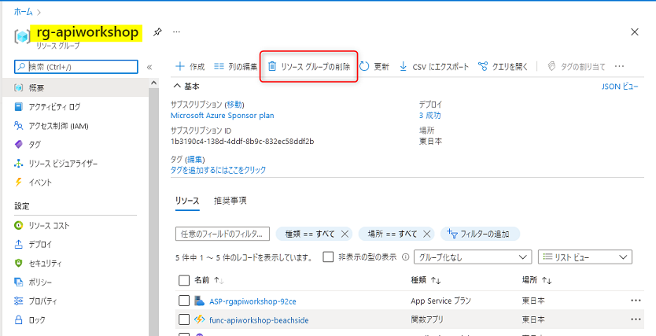
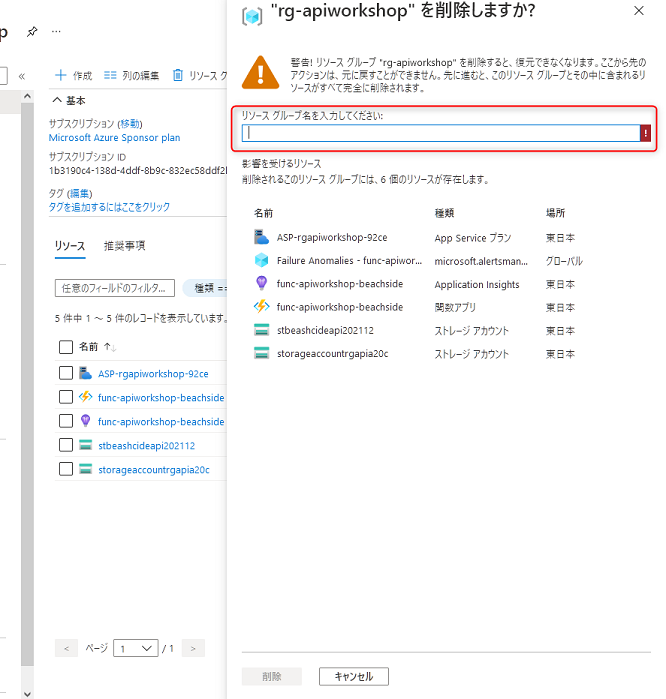

# Azure のリソースを削除する

最後に今回作成した Azure のリソースを削除する方法をご案内します。必要に応じて削除してください。

リソースを個別に削除することも可能ですが、リソースグループを削除することでその中のリソースを一括で削除することが可能です。

Azure ポータル `https://portal.azure.com` で、今回のワークショップで作成したリソースグループ `rg-apiworkshop` を開き、上部にある **リソースグループの削除** をクリックします。

 

確認のブレードが表示されます。リソースグループ名を入力して **削除** ボタンをクリックします。

これでリソースグループ内のリソースが一括削除されます。誤って別のリソースグループに作成したリソースは削除されませんのでご注意ください。

🎉🎉 ワークショップお疲れ様でした。 🎉🎉

---

[目次へ戻る](./selfpaced-handson.md)