# Azure へのデプロイ

ここまで作ってきたプログラムをデプロイする方法を学びます。

- [ ] Azure ポータルで Azure Functions のリソース作成
- [ ] Visual Studio から Azure へデプロイ
- [ ] デプロイした Function App の確認

 

## ステップ 1. Azure ポータルで Azure Functions のリソース作成

Azure ポータル `https://portal.azure.com` を開き、画面上部の検索で「関数」と入力すると **関数アプリ** が表示されますのでクリックします。

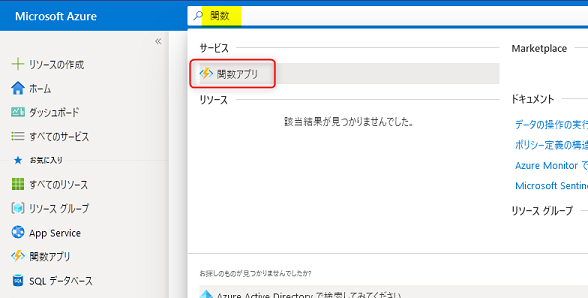

関数アプリの一覧が表示されます。**作成** ボタンをクリックします。

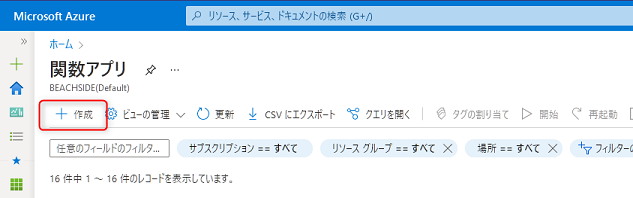

関数アプリの作成画面が表示されます。**基本** タブが表示されますので、以下を参考に入力します。

- **サブスクリプション**: 任意のサブスクリプションを選択します。
- **リソースグループ**: **新規作成** をクリックし、`rg-apiworkshop`と入力し、**OK**: ボタンをクリックします。
- **関数アプリ名**: この値はグローバルで一意になる必要があります。受講者皆さんが同じ値を入れることはできません。`func-apiworkshop-<任意の名前など>` と入力してください。
- **公開**: `コード` を選択
- **ランタイムスタック**: `.NET` を選択
- **バージョン**: `6` を選択
- **地域**: 任意の場所で問題ありませんが、東日本リージョンを選びたい場合は `japan East` を選択します。

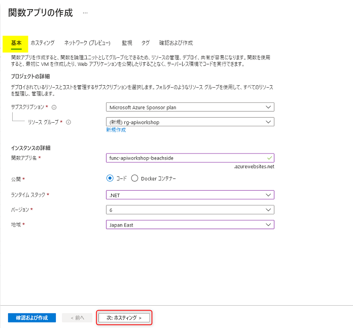

入力したら画面下部の **次: ホスティング** をクリックします。

**ホスティング** タブが表示されます。

この画面では OS やプランを選択できます。今回は OS が `Windows` 、プランは `消費量 (サーバーレス)` に選択されていることを確認します。

他にも **ネットワーク** や **監視** のタブがありますが今回は特に設定不要です。画面下部にある **確認および作成** ボタンをクリックします。

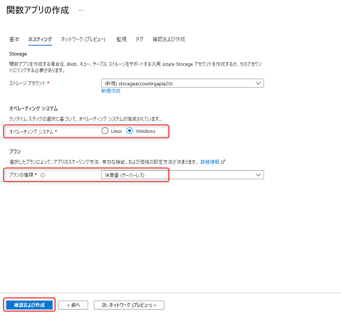

エラーが表示されていなければ、**作成** ボタンをクリックしてリソースの作成を行います。

エラーが表示されている場合は、エラー内容を確認して入力内容を修正します。

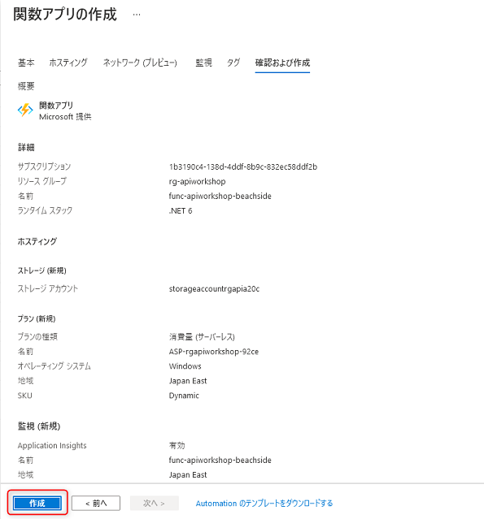

リソースの作成は通常1分程度で完了します。完了したら **リソースに移動** ボタンをクリックして、作成した 関数アプリ (Function App) を開きます。

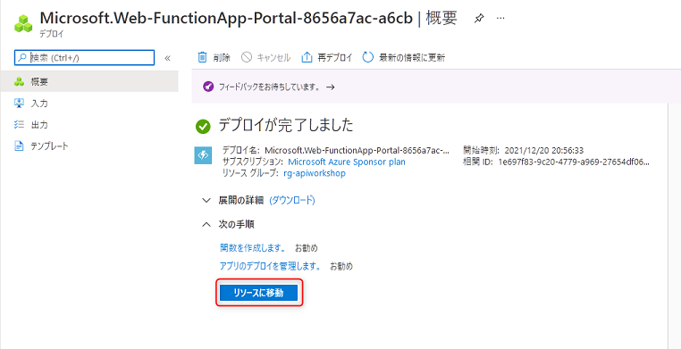

のちほどこの画面から確認を行うので、ブラウザーはこのままにしておきます。

 

## ステップ 2. Visual Studio から Azure へデプロイ

Visual Studio を使って、Azure 上の Function App へデプロイを行います。手順は以下の2つです。

- 発行プロファイルの作成
- 発行する

### 発行プロファイルの作成

ソリューションエクスプローラーでプロジェクト名を右クリック → **発行** ボタンをクリックします。

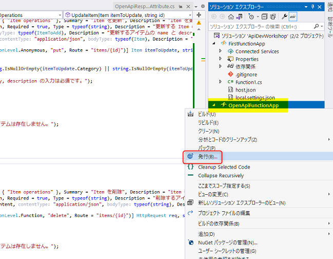

**公開** のウインドウが表示されます。**Azure** が選択されていることを確認し、**次へ** ボタンをクリックします。

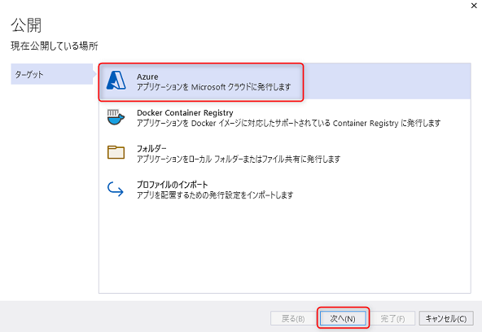

**Azure Function App (Windows)** が選択されていることを確認して **次へ** ボタンをクリックします。

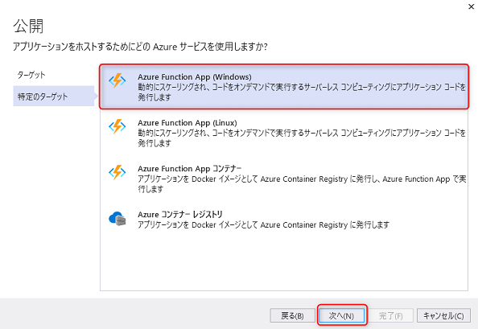

まず、ウインドウ右上のアカウントやサブスクリプション名が正しく選択されているかを確認します。

先ほど作成した Function App が検索できますので、選択して **次へ** ボタンをクリックします。

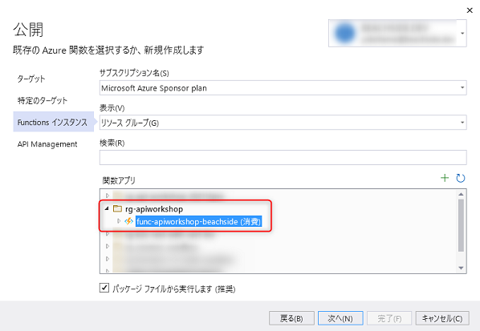

API Management の設定画面ですが今回は利用しないため、**この手順をスキップする** にチェックを入れて **完了** ボタンをクリックします。

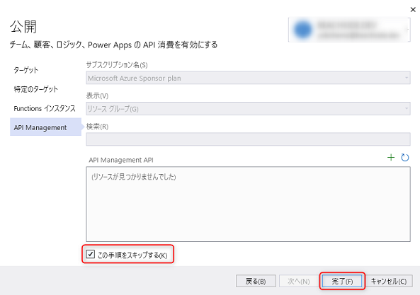

これで発行プロファイルの作成が完了しました。

### 発行する

発行プロファイルが作成出来たら、**発行** ボタンをクリックしましょう。これで指定した Function App へデプロイが始まります。

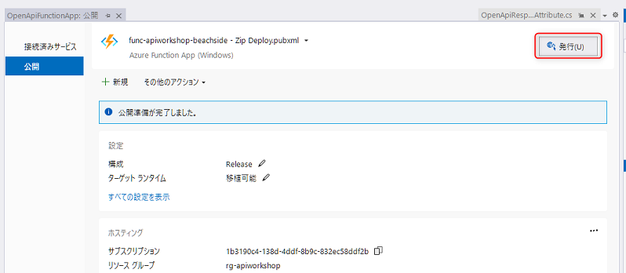

デプロイの進捗は、Visual Studio の出力ウインドウで確認ができます。

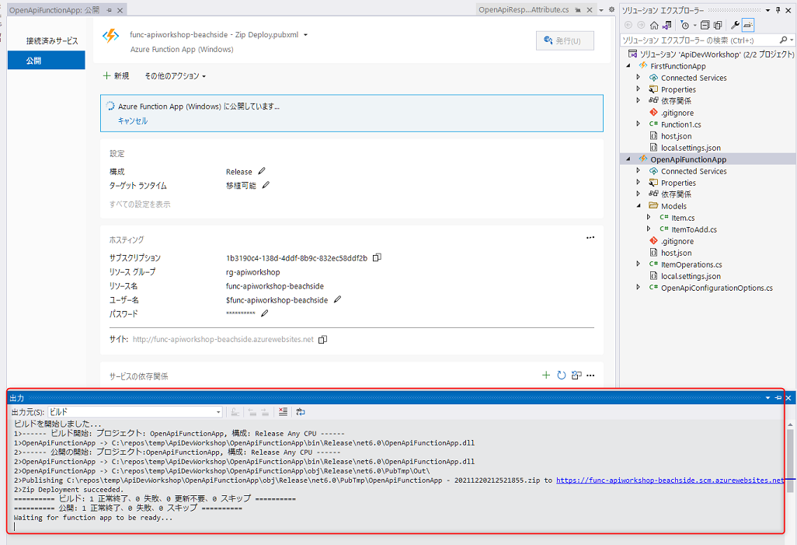

発行が確認出来たら、次は Azure ポータルから確認してみましょう。

 

## ステップ 3. デプロイした Function App の確認

### Azure ポータルからデプロイした Function App の確認

ブラウザーに戻って先ほど開いたままの Azure ポータルを表示します。左側のメニューにある **関数** をクリックすると Function のエンドポイントの一覧が確認できます。

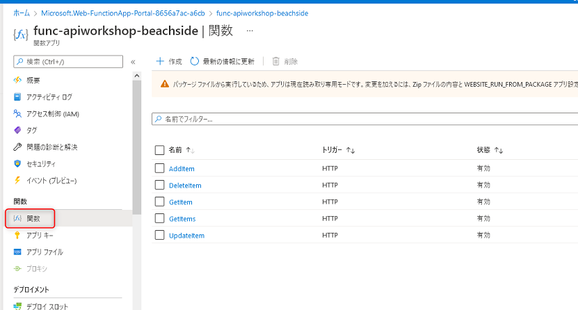

### Swagger UI で確認

左側のメニューにある **概要** をクリックすると、Function App の URL が確認できます。クリックしてみましょう。

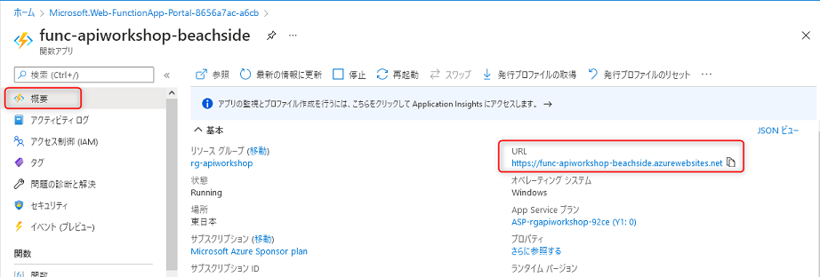

デフォルトのトップ画面が表示されます。

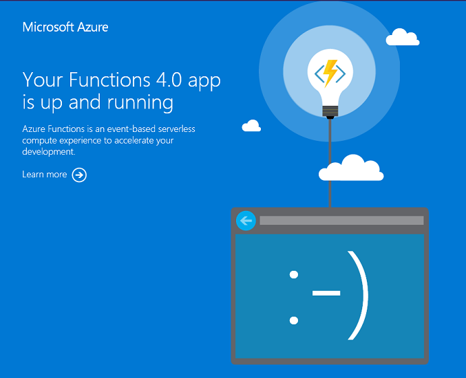

URL の後ろに `/api/swagger/ui` と入力して画面を表示すると、先ほど作成した Swagger UI が確認できます。ここから API をコールすることで、デプロイされた Function App の動作を確認することができます。

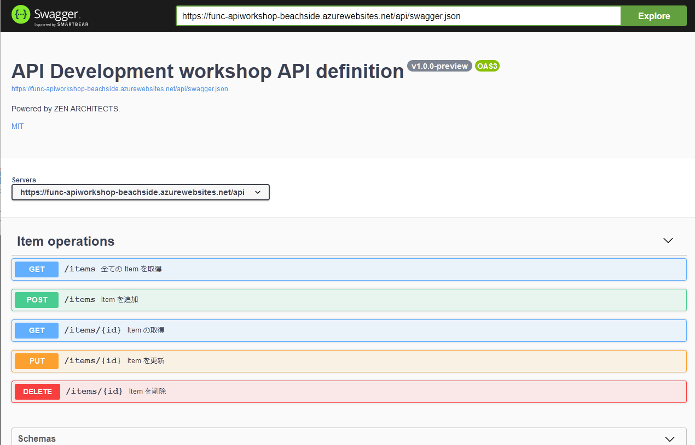

 

## (オプション) CORS の設定

今回のワークショップでは直接関係ないですが、他のオリジンの UI からこの Function App の Swagger UI の URL からアクセスすると [CORS](https://developer.mozilla.org/ja/docs/Web/HTTP/CORS) のエラーが表示されます。

Function App の CORS の設定は、Azure ポータルで Function App のリソースを開き、メニュー **CORS** からできます。

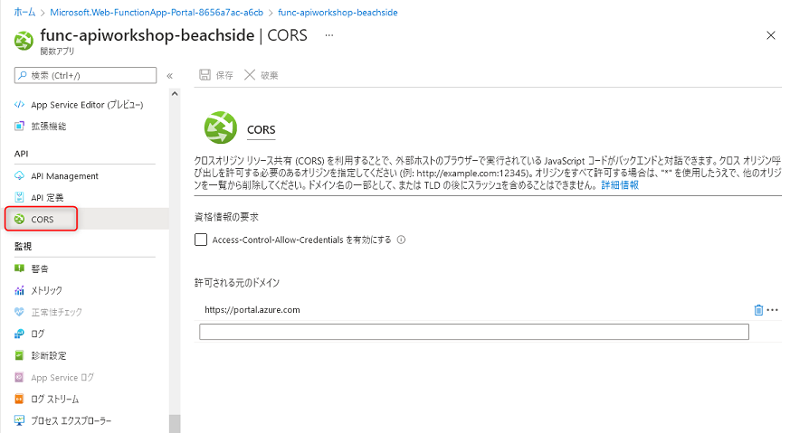

- 参考ドキュメント: [クロス オリジン リソース共有 - Function App の管理 | Microsoft Docs](https://docs.microsoft.com/ja-jp/azure/azure-functions/functions-how-to-use-azure-function-app-settings?tabs=portal#cross-origin-resource-sharing)

 

## 🎉 Congratulations 🎉

ここでは、以下の内容を習得しました。

- ✅ Azure ポータルで Azure Functions のリソース作成
- ✅ Visual Studio から Azure へデプロイ
- ✅ デプロイした Function App の確認

次は応用編として、Http trigger の Function の処理で、Azure の Storage へファイルを保存する方法を学びます。

 

[戻る](./create-methods.md) | [**次へ: Azure Storage へファイルを保存する API の作成**](./create-function-app-with-blob-output-binding.md)

----

[目次へ戻る](./selfpaced-handson.md)

