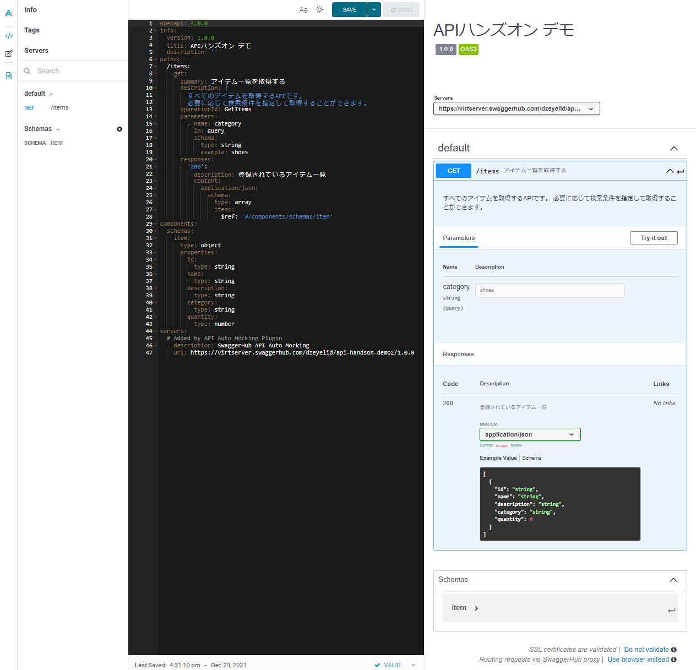

# OpenAPI について知る

## おおまかな流れ

- [OpenAPI の要点をおさらい](#openapi-の要点をおさらい)
- [Swagger UI の紹介](#swagger-ui-の紹介)
- [Swagger UI を使ってみる](#swagger-ui-を使ってみる)

## OpenAPI の要点をおさらい

OpenAPI について、おさらいしましょう。

OpenAPI Specification (OAS) は、[OpenAPI Initiative](https://www.openapis.org/) が策定している、HTTPプロトコルにおける API の定義を統一するための仕様です。

いくつかバージョンがあり、現在は `3.x` バージョンが主流です。

Swagger が公開している仕様のドキュメントが、要点がまとめられて読みやすいです。

- [OpenAPI Specification - Version 3.0.3 | Swagger](https://swagger.io/specification/)

### 記述例（YAML）

```yml
openapi: 3.0.3
info:
  title: API definition sample
  description: |
    This is a sample of OpenAPI definition.
  version: v1.0.0
servers:
  - url: https://example.com/api
paths:
  /items:
    get:
      summary: アイテム一覧を取得する
      description: |
        登録されているアイテム一覧を取得します。
      operationId: GetItems
      responses:
        '200':
          description: 登録されているアイテム一覧
          content:
            application/json:
              schema:
                type: array
                items:
                  $ref: '#/components/schemas/item'
components:
  schemas:
    item:
      type: object
      properties:
        id:
          type: string
        name:
          type: string
        description:
          type: string
        quantity:
          type: number
```

## Swagger UI の紹介

Swagger UI は、OpenAPI の仕様を読み込んで UI に起こしてくれるツールです。

Swagger UI では、OpenAPI で記述されたリクエストを、視覚的に確認したり、実際にリクエストを送信することができます。

Swagger UI を利用するには、Swagger や有志による様々な方法が提供されています。

- [SwaggerHub](https://swagger.io/tools/swaggerhub/)
- [npm, docker image, unpkg による配布](https://github.com/swagger-api/swagger-ui/blob/master/docs/usage/installation.md)
- Visual Studio Code Extension: [Swagger Viewer - Visual Studio Marketplace](https://marketplace.visualstudio.com/items?itemName=Arjun.swagger-viewer)
- Visual Studio Code Extension: [OpenAPI (Swagger) Editor - Visual Studio Marketplace](https://marketplace.visualstudio.com/items?itemName=42Crunch.vscode-openapi)

## OpenAPI の仕様を眺めてみる

それでは、OpenAPI で書かれた定義を見てみましょう。

### OpenAPI 仕様を眺めてみる

まず、OpenAPI で記述したAPI仕様を眺めてみます。

このURLを開いてみてください。この仕様は、後半の実践で作成するAPIの仕様です。

- JSON: https://func-apidevworkshop-zen.azurewebsites.net/api/swagger.json
- YAML: https://func-apidevworkshop-zen.azurewebsites.net/api/swagger.yaml

どうですか？見慣れるとすぐに把握できるのですが、なかなか大変ですね。そこで Swagger UI の出番です。

### OpenAPI 仕様を Swagger UI で眺める

前述の仕様を Swagger UI に適用してみましょう。このURLを開いてみてください。

Swagger UI: https://func-apidevworkshop-zen.azurewebsites.net/api/swagger/ui

このように Swagger UI を利用すると、JSON や YAML よりも断然見やすく、Swagger UI 上でリクエストを送信することもできるので、非常に便利になります。

### OpenAPI で API仕様を記述してみる（デモ）

OpenAPI をどう記述していくかも確認してみましょう。

ここでは、[SwaggerHub](https://app.swaggerhub.com/) を利用してデモを行います。もし一緒に体験したい方は、[こちら](https://try.smartbear.com/)から SwaggerHub のアカウントを作成しご利用ください。

#### `paths` や `components` を記述する

下記の定義を記述していきます。

```yml
openapi: 3.0.0
info:
  version: 1.0.0-preview
  title: API開発ハンズオン デモ
  description: API開発ハンズオンのデモ用定義です。
paths:
  /items:
    get:
      summary: アイテム一覧を取得する
      description: |
        すべてのアイテムを取得するAPIです。
        必要に応じて検索条件を指定して取得することができます。
      operationId: GetItems
      parameters: 
        - name: category
          in: query
          schema:
            type: string
            example: shoes
      responses:
        '200':
          description: 登録されているアイテム一覧
          content:
            application/json:
              schema:
                type: array
                items:
                  $ref: '#/components/schemas/item'
components:
  schemas:
    item:
      type: object
      properties:
        id:
          type: string
        name:
          type: string
        description:
          type: string
        category:
          type: string
        quantity:
          type: number
```



#### 認証を記述する

APIは認証も大事なポイントです。OpenAPI では、主要な認証方式も記述することができます。

```yml
components:
  securitySchemes:
    ApiKeyAuth:
      type: apiKey
      name: api_key
      in: header
    BearerAuth:
      type: http
      scheme: bearer

security: 
  - ApiKeyAuth: []
  - BearerAuth:
    - scope1
    - scope2
```

OpenAPI の認証に関する定義については、下記が参考になります。

- [Authentication - Swagger](https://swagger.io/docs/specification/authentication/)

このように、OpenAPI は、エディタを含め Swagger UI と組み合わせると非常に便利に記述、運用していくことができます。

### 実際に記述する際のポイント

OpenAPI の定義を運用していくにあたり、役立つポイントをいくつかご紹介します。

| ポイント | 説明 |
|----|----|
| コードと同様に履歴管理を行う | OpenAPI を定義したファイルは、コードと同じように Git 等を用いてバージョン管理するとをお勧めします。コードの変更とともに、OpenAPI 定義も更新していくことで、ドキュメントの陳腐化を防ぎ、チームで効率の良い開発を続けることができます。 |
| `Components` を活用する | OpenAPI の記述で同じ構造の定義は、`Components` の配下にまとめて `$ref: '#/components/~~'` で参照することで、構造の重複を防ぐことができます。これにより、設計の最適化ができ、ドキュメントのメンテナンス性の向上にもつながります。|
| Swagger UI を使ってリクエストを行うときは CORS の制限に注意する | Swagger UI はブラウザベースのツールなので、実行する先の API の CORS が許可されている必要があります。配置する場所や API の CORS の設定にご留意ください。 |
| サーバーやクライアントの自動生成ツールもある | [OpenAPI Generator](https://openapi-generator.tech/) のように、OpenAPI の定義からサーバー実装の土台であったり、API実行用のクライアントのコードベースを生成することができるツールがあります。 |

それでは、次は実際にコードに触れて理解を深めていきましょう。

[戻る](./call-apis.md) | [次へ](./create-first-http-client.md)

----

[目次へ戻る](./selfpaced-handson.md)
