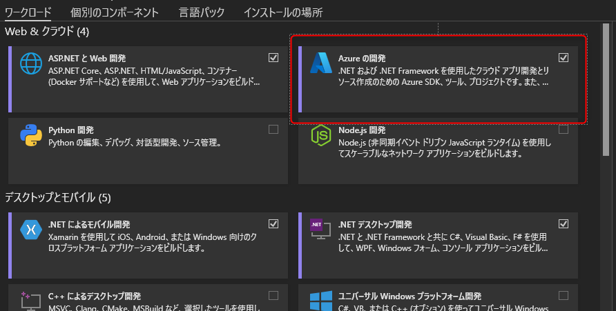

# 事前準備

このワークショップは、Visual Studio を利用して Azure Functions をベースとした API の開発です。

ワークショップを開始する前に準備は以下となります。

- Visual Studio 2022 のインストール
- Postman のインストール
- Azure サブスクリプションの用意

## Visual Studio 2022 のインストール

IDE は Visual Studio を利用します。最新の .NET と Azure Functions のバージョンを利用するために、Visual Studio 2022 を利用します。

未インストールの場合、以下のリンクから Visual Studio 2022 をインストールしてください。エディション (Community, Professional, Enterprise) は不問です。

- [Visual Studio](https://visualstudio.microsoft.com/ja/)

インストール時には、ワークロードで **Azure の開発** を選択が必須です。

## Postman のインストール

REST API をコールする際にクライアントとして Postman を使います。API クライアントがない場合は、以下よりダウンロードしてインストールをしてください。

- [Postman](https://www.postman.com/downloads/)

※ 講師は Postman を使って説明しますが、他の API クライアントをご利用の場合は、それを使っていただいても問題ありません。

## Azure サブスクリプションの用意

Azure Functions を利用しますので、Azure Functions のリソースが作成可能なサブスクリプションをご用意ください。
